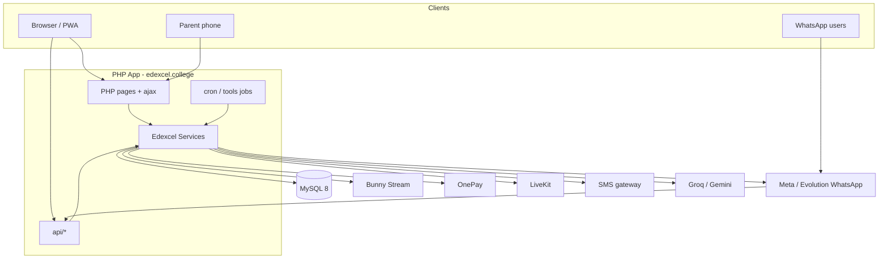
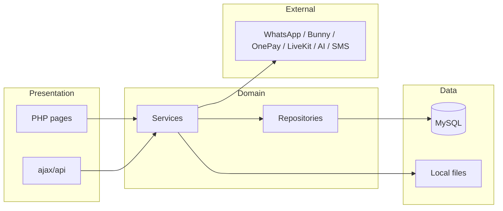
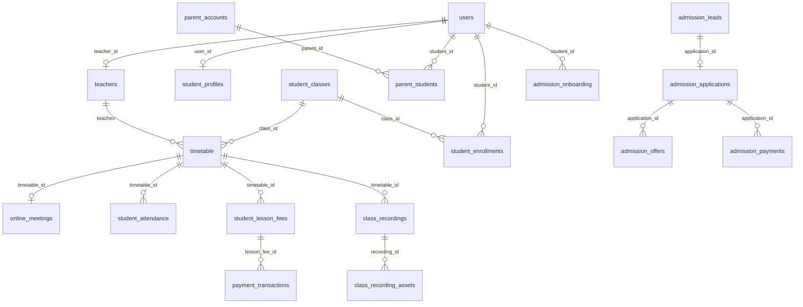
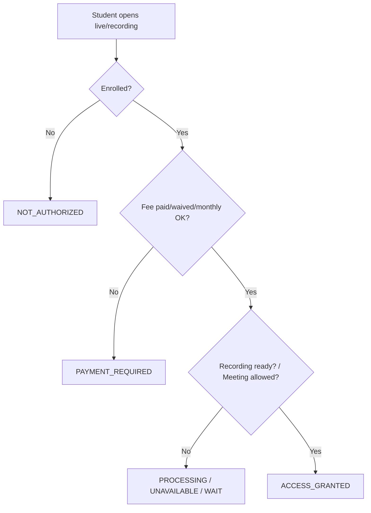
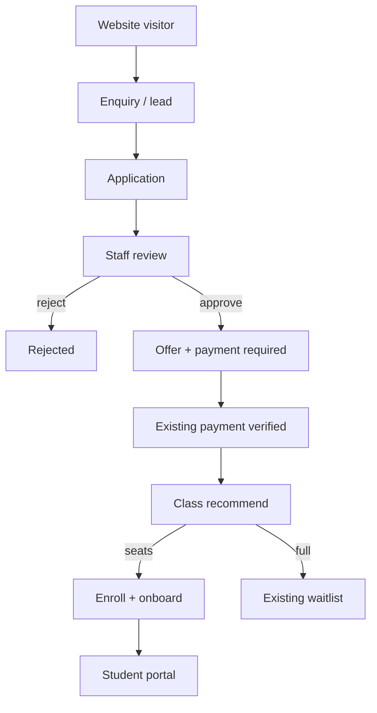
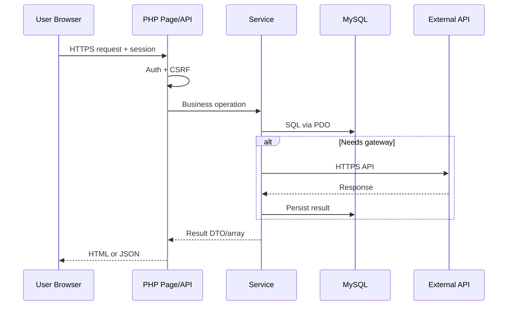
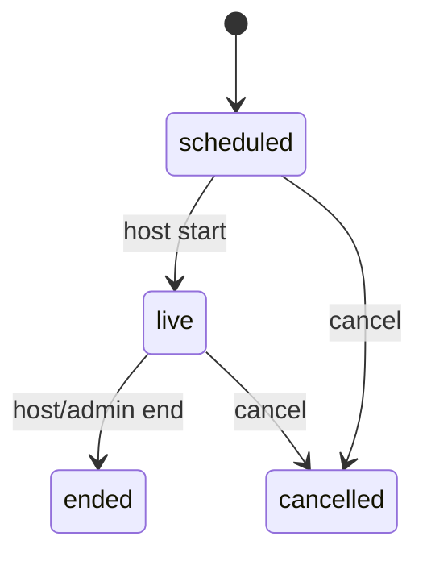
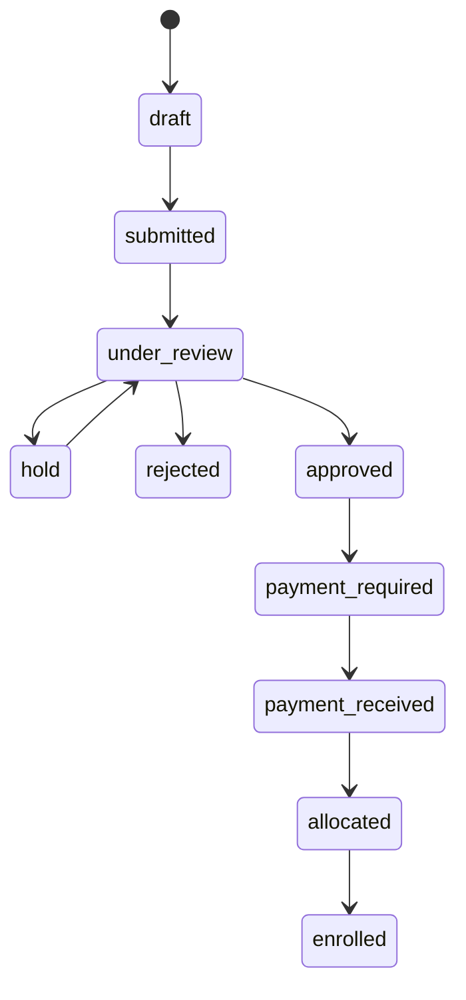

# Edexcel College — Complete System Documentation

| Field | Value |
| --- | --- |
| System name | Edexcel College Timetable / Campus Portal |
| Composer package | `edexcel/timetable` |
| Live site | https://edexcel.college |
| Legacy host | `kandy.edexcel.college` (retired; should 301 to apex — see `deploy/kandy-to-apex-redirect.md`) |
| Document root | `public_html` (this repository) |
| Production env file | `/home/edexcel.college/.env` (outside web root; preferred by `config/load_env.php`) |
| Timezone | Asia/Colombo |
| Default class fee | Rs 500 / student (overridable per lesson) |
| Stack | PHP ≥ 8.1, MySQL 8, Composer, Bootstrap / Bootstrap Icons |
| PHP namespace | `Edexcel\` (`src/` via Composer PSR-4) |
| Document version | 2026-09-19 |
| Public brand | **Edexcel College** (legacy “Edexcel College Kandy” / “Kandy Edexcel College” normalized via `college_brand_name()`) |
| License | Proprietary — Edexcel College use only |

**Related docs (do not duplicate secrets here):**

- `README.md` — short install + Evolution bot notes
- `DEPLOYMENT_NOTES.md` — upload, `.env`, PHP extensions, cron, FTP
- `.vscode/sftp.json` — production FTP credentials (secrets; excluded from backups)
- `.cursor/rules/ftp-deploy.mdc` — agent deploy behaviour
- `WHATSAPP_CLOUD_API.md` — Meta Cloud API IDs, Embedded Signup, errors
- `deploy/livekit/README.md` — self-hosted LiveKit VPS stack
- `deploy/kandy-to-apex-redirect.md` — legacy hostname 301

**Accuracy rules used in this document:**

- Confirmed = implemented in this repository
- **Not specified** / **Unknown** = not found in code or config
- **Assumption** = reasonable inference, not proven
- **Proposed** = future / not implemented

---

## Table of Contents

1. [System Overview](#1-system-overview)
2. [Requirements](#2-requirements)
3. [System Architecture](#3-system-architecture)
4. [Technology Stack](#4-technology-stack)
5. [Project Structure](#5-project-structure)
6. [User Roles & Permissions](#6-user-roles--permissions)
7. [Authentication & Authorization](#7-authentication--authorization)
8. [Database Design](#8-database-design)
9. [API Documentation](#9-api-documentation)
10. [Frontend](#10-frontend)
11. [Backend](#11-backend)
12. [Business Logic](#12-business-logic)
13. [Complete User Workflows](#13-complete-user-workflows)
14. [Integrations](#14-integrations)
15. [Configuration & Environment Variables](#15-configuration--environment-variables)
16. [Security](#16-security)
17. [Error Handling](#17-error-handling)
18. [Logging & Monitoring](#18-logging--monitoring)
19. [Caching & Performance](#19-caching--performance)
20. [File & Storage Management](#20-file--storage-management)
21. [Notifications & Communication Platform](#21-notifications--communication-platform)
22. [Testing](#22-testing)
23. [Deployment](#23-deployment)
24. [CI/CD](#24-cicd)
25. [Infrastructure](#25-infrastructure)
26. [Backup & Disaster Recovery](#26-backup--disaster-recovery)
27. [Maintenance](#27-maintenance)
28. [Troubleshooting](#28-troubleshooting)
29. [Development Guide](#29-development-guide)
30. [Coding Standards](#30-coding-standards)
31. [Data Flow](#31-data-flow)
32. [State & Lifecycle](#32-state--lifecycle)
33. [Edge Cases](#33-edge-cases)
34. [Known Limitations](#34-known-limitations)
35. [Future Improvements](#35-future-improvements)
36. [Glossary](#36-glossary)
37. [Complete Reference Tables](#37-complete-reference-tables)
39. [Production DDoS, Abuse & Availability Protection](#39-production-ddos-abuse--availability-protection)

---

## 1. System Overview

### 1.1 System name

**Edexcel College Campus Portal** (Composer name: `edexcel/timetable`). Historically a timetable system; now a full college operations portal.

### 1.2 Purpose

Provide a single PHP/MySQL web application for Edexcel College to manage:

- Staff and student authentication
- Timetable and recurring class generation
- Classroom operations (attendance, fees, marks, homework, documents)
- Live online/hybrid classes (LiveKit)
- Class recordings (Bunny Stream) with paywall
- Student and parent portals
- WhatsApp bot / reminders / OTP
- Official Pearson/Edexcel exam planner
- Talk with AI (Courso) learning assistant
- Teacher payroll and student fee collection (cash, OnePay, bank slip)
- Student lifecycle: website enquiry → lead → application → admission offer → payment → class allocation → enrollment → onboarding → transfer/withdrawal/completion

### 1.3 Problem being solved

A tuition college needs coordinated schedules, fee collection before live/recording access, parent visibility, messaging, and exam planning without a full Moodle-style LMS or a separate native mobile app.

### 1.4 Goals and objectives

| Goal | How addressed |
| --- | --- |
| Accurate weekly timetable | Recurring schedules, holidays, conflict detection, locks |
| Collect lesson fees before access | `student_lesson_fees` + Class fees / OnePay / bank / monthly wallet |
| Operate physical + online classes | `delivery_mode`, LiveKit room, attendance |
| Keep parents informed | Portal Google / OTP login, digests, fee pings, view tokens |
| Reduce office load | WhatsApp bot, cron reminders, outbox queue |
| Auditability | Soft deletes, `audit_logs`, `timetable_audit_log`, payment events, `admission_lifecycle_events` |
| Admit without duplicate records | Lead duplicate review (never auto-merge); reuse existing `users` / enrollments |

### 1.5 Target users

| User | Portal |
| --- | --- |
| College admin / office | `/login.php` → `/dashboard.php`, `/admin/*` |
| Teachers | `/login.php` → `/dashboard.php`, `/campus/*`, `/timetable/*` |
| Students | Homepage / `/student/*` |
| Parents | `/portal/login.php`, `/parent/*` |
| Public visitors | Homepage, `/teachers/`, Talk with AI (public), legal pages, `/admissions/*` |
| Admissions staff | `/admin/admissions_control.php` (admin always; teachers only with `admissions.*` grants) |

### 1.6 Major capabilities

1. Public homepage (configurable layouts 1–10), teacher directory, timetable search
2. Admin office: students, users, settings, payments, WhatsApp, jobs health, backup, audit
3. Teacher classroom: schedule, attendance, class fees, marks, papers, recordings, video library, cash handover
4. Student portal: classes, live join, recordings, exams, fees, attendance, documents, Talk with AI, device lock
5. Parent portal: multi-child management, unified Google OAuth & OTP login, today snapshot, pay lesson
6. Official Pearson/Edexcel exam series import + student paper picks
7. WhatsApp chatbot (Meta Cloud API or Evolution) + class reminders
8. Optional SMS OTPs
9. Live classroom (LiveKit) with chat, whiteboard, waiting room, egress → Bunny
10. Bank transfer slip verification for lesson fees
11. Admissions command centre: leads, applications, offers, class allocation, onboarding
12. Unified Communication & Engagement Platform: hub, announcements, threads, WA/SMS delivery tracking, parent/student history, staff workbench
13. Public catalogue API for programmes/classes (no student PII)
14. Teaching slide decks (`/ppt/`) — Reveal.js lesson/paper walkthroughs with shared teacher credit

### 1.7 Scope

In scope: everything under `public_html` that serves the live college site, including `src/`, `config/`, `database/migrations/`, `cron/` / `tools/` job scripts, and `deploy/livekit/` (VPS copy, not HTTP-served).

### 1.8 Out-of-scope functionality

- Native iOS/Android apps (**Not specified** beyond PWA-ish `manifest.json` / service worker)
- Generic multi-tenant SaaS for other colleges
- Full Moodle-style LMS courses / SCORM
- Separate accounting / payroll ERP
- Email-based transactional mailer product (**Not specified** as primary channel; WhatsApp/SMS used)

### 1.9 High-level system description

Pages are mostly **PHP scripts in folders** (not a single front-controller framework). Shared bootstrap loads `.env`, PDO, sessions, auth helpers. Business logic lives in `Edexcel\Services\*`. Schema evolves via numbered SQL migrations plus runtime `ensure_*_schema()` healers. External systems: Meta/Evolution WhatsApp, Bunny Stream, OnePay, LiveKit (+ optional MinIO/S3), SMS gateway, Groq/Gemini for AI text.



---

## 2. Requirements

### 2.1 Functional Requirements

| ID | Requirement | Status |
| --- | --- | --- |
| FR-01 | Staff login with password and/or WhatsApp OTP | Confirmed |
| FR-02 | Student register/login with WhatsApp or SMS OTP | Confirmed |
| FR-03 | Parent login via portal Google OAuth and/or WhatsApp/phone OTP; multi-child linking via `parent_students` / admin verification | Confirmed |
| FR-03b | Student/parent Google SSO at `/portal/login.php`; staff never created via Google; LK visitors must SMS-link phone after Google (`GeoIpService` / `/auth/phone.php`) | Confirmed |
| FR-04 | Timetable CRUD with conflict detection, lock, soft delete | Confirmed |
| FR-05 | Recurring weekly schedule generation; skip holidays | Confirmed |
| FR-06 | Teacher commission / payroll payment tracking | Confirmed |
| FR-07 | Mark attendance present/absent/late/excused per lesson | Confirmed |
| FR-08 | Collect per-lesson class fees (cash, OnePay, bank slip, waive) | Confirmed |
| FR-09 | Monthly student fee ledger (wallet) at counter | Confirmed |
| FR-10 | Gate live class join and recording playback on lesson fee | Confirmed |
| FR-11 | Upload/process class recordings via Bunny Stream (per-teacher library) | Confirmed |
| FR-12 | Teacher reusable video library with visibility rules | Confirmed |
| FR-13 | Online/hybrid lessons via LiveKit tokens, chat, whiteboard | Confirmed |
| FR-14 | Auto-record live class egress into Bunny when enabled | Confirmed |
| FR-15 | Student enroll/leave by class code; waitlist + 24h offer | Confirmed |
| FR-16 | Homework assign + student submit + teacher review | Confirmed |
| FR-17 | Marks/progress with publish flag | Confirmed |
| FR-18 | Campus mock exams + official Pearson exam import/selection | Confirmed |
| FR-19 | WhatsApp bot intents for timetable, fees, admissions, etc. | Confirmed |
| FR-20 | Cron: class reminders, outbox drain, parent digest, Bunny sync, ops jobs, Courso nudges | Confirmed |
| FR-21 | Talk with AI (student) + public AI chat | Confirmed |
| FR-22 | Cash handover teacher → office | Confirmed |
| FR-23 | Student device limit (max 4) + single active session | Confirmed |
| FR-24 | Theme preference; English/Sinhala for selected screens | Confirmed |
| FR-25 | Homepage layout selection (layout1–layout10) | Confirmed |
| FR-26 | Admin backup / audit log / system health jobs page | Confirmed |
| FR-27 | Legal pages: privacy, terms, refund, data deletion, contact | Confirmed |
| FR-28 | Online lesson sequenced content (video/activity/page) with watch % | Confirmed |
| FR-29 | Public enquiry / lead CRM with auditable pipeline | Confirmed |
| FR-30 | Online application, draft/save, public status tracking (no internal notes) | Confirmed |
| FR-31 | Application review, offer, document upload via SecureUpload | Confirmed |
| FR-32 | Admission payment uses existing payment system (no second gateway) | Confirmed |
| FR-33 | Explainable class recommendation + waitlist when full | Confirmed |
| FR-34 | Enrollment, parent link, onboarding checklist, operational agreements | Confirmed |
| FR-35 | Transfer / withdrawal / completion / re-enrollment on existing student identity | Confirmed |
| FR-36 | Admissions analytics funnel + staff permissions `admissions.*` | Confirmed |
| FR-37 | Public `/api/v1/public.php` catalogue; staff `/api/v1` admissions resources | Confirmed |
| FR-38 | Advisory AI admissions assistant (must not decide or discriminate) | Confirmed |

### 2.2 Non-Functional Requirements

| Area | Requirement | Notes |
| --- | --- | --- |
| Performance | Page scripts and JSON APIs suitable for college-scale traffic | Exact SLAs **Not specified** |
| Scalability | Single app server + MySQL; LiveKit on separate VPS/Cloud | Horizontal scale **Not specified** |
| Availability | Production on OpenLiteSpeed/CyberPanel or Apache/Nginx + PHP-FPM | SLA **Not specified** |
| Reliability | Soft delete, payment status re-query, Bunny/LiveKit webhook + cron catch-up | |
| Security | HTTPS, CSRF, role guards, webhook signatures, login throttle, CSP headers | See §16 |
| Maintainability | Migrations + `ensure_*` schema; PSR-4 services | Mixed script/MVC style |
| Usability | App rail navigation; student tabs; Sinhala on fees/attendance/parent | |
| Accessibility | **Not specified** as WCAG target | Bootstrap-based UI |
| Compatibility | Modern browsers; PHP 8.1+; MySQL 8 | Mobile responsive **Assumption**: Bootstrap layouts |

---

## 3. System Architecture

### 3.1 Frontend

- Server-rendered PHP pages + partials (`includes/`, `views/`, `layouts/`, `student/views/`)
- Static assets: `assets/css`, `assets/js`, Bootstrap Icons
- Client JS for homepage layouts, LiveKit room, Bunny TUS upload, session ping, theme
- Optional service worker (`service-worker.js` / `sw.js`) — network-first for HTML/API

### 3.2 Backend

- Procedural PHP entry scripts
- Shared config: `config/bootstrap.php`, `database.php`, `auth.php`, `security.php`
- Domain services under `src/Services/`
- Repositories: `TimetableRepository`, `TeacherRepository`, `StudentRepository`, `PaymentRepository`, `RecurringScheduleRepository`
- Controllers: primarily `TimetableController` (timetable-centric); most pages call services directly

### 3.3 APIs

JSON endpoints under `api/` (classroom, courso, public_ai, timetable, theme, webhooks) plus Unified College API `api/v1/` (session) and public catalogue `api/v1/public.php`. AJAX helpers under `ajax/`.

### 3.4 Database

MySQL 8, utf8mb4, PDO. Credentials from `.env`. Schema via `database/migrations/*.sql` + runtime ensure functions.

### 3.5 Authentication / authorization

PHP sessions. Roles in `users.role`: `admin`, `teacher`, `student`. Parents use separate session keys (`parent_id`, …) via `ParentAuthService`. Unified student/parent entry: `/portal/login.php` (Google OAuth + legacy phone OTP). Staff stay on `/login.php` (password; no Google). Guards: `require_login`, `require_staff`, `require_admin`, `require_teacher`, `require_student`. Admissions pages use `AdmissionAuth` plus optional `staff_permissions` rows; admins always pass; teachers do not see admissions data unless granted.

### 3.6 External services

WhatsApp (Meta or Evolution), SMS gateway, Bunny.net Stream, OnePay.lk, LiveKit, Groq/Gemini, optional MinIO/S3 for egress.

### 3.7 Third-party integrations

See §14. Docker Compose at repo root runs Evolution API only. LiveKit stack is under `deploy/livekit/`.

### 3.8 Background jobs

CLI PHP scripts in `cron/` (and `tools/` copies for FTP-restricted servers). Tracked in `system_job_runs`. Optional HTTP cron guard via `CRON_KEY`.

### 3.9 Queues

| Queue | Mechanism |
| --- | --- |
| WhatsApp bot / OTP | `whatsapp_outbox` (attempts, `next_attempt_at`; max 5) |
| Communication hub | `communication_messages` + `communication_recipients` (+ `communication_bulk_jobs` for preview/confirm); drained by `communication_queue` cron (`processQueue(40)`) |
| Legacy scheduled rows | `CommunicationService::due` for messages **without** recipients (same cron) |

No Redis/RabbitMQ for app queues (**Not specified**). LiveKit deploy uses Redis for LiveKit itself.

### 3.10 Storage

- Local: `uploads/`, `files/documents`, `files/homework`, `files/materials`, `files/payment_slips`, `assets/images/teachers/`
- Bunny Stream for video
- MinIO/S3 for LiveKit egress (self-hosted)

### 3.11 Caching

`config/cache.php` present; `CACHE_TTL` may appear in `.env`. Courso public rate-limit table `courso_public_rl`. Exact cache backend usage: **partially specified** — file/cache folder exists; no Redis app cache documented.

### 3.12 Notifications

Primary college messaging goes through the **Communication Hub** (`CommunicationHubService`) → `notification_center` / WhatsApp / SMS, with delivery events and Channel ops retries. Legacy per-role tables (`student_notifications`, `teacher_notifications`, `admin_notifications`) and some `campus_notify_*` paths still exist alongside the hub. OTP and bot traffic remain on WhatsApp/SMS + `whatsapp_outbox`. Courso study nudges via cron. Full platform detail: **§21**.

### 3.13 Logging

PHP error handler (`config/error_handler.php`). Audit tables. WhatsApp message/query logs. Payment transaction events. Job run messages. Application log files: **Not fully specified** (`.log` blocked by `.htaccess`).

### 3.14 Monitoring

Admin **System health** `/admin/jobs.php` via `SystemHealthService` (last job runs, WhatsApp token debug). No Datadog/New Relic integration found.



---

## 4. Technology Stack

| Technology | Version | Purpose | Where used | Important configuration |
| --- | --- | --- | --- | --- |
| PHP | ≥ 8.1 (8.2/8.3 recommended) | Application runtime | Entire site | `pdo_mysql`, sessions, curl, mbstring, fileinfo |
| MySQL | ≥ 8.0 | Primary datastore | All modules | utf8mb4; `.env` DB_* |
| Composer | project | Dependencies / PSR-4 | `vendor/`, `src/` | `composer.json` |
| vlucas/phpdotenv | 5.6.4 (lock) | Env loading concept; custom loader also in `load_env.php` | Bootstrap | `.env` |
| dompdf/dompdf | 3.1.6 | Timetable PDF export | `timetable/export_pdf.php` | Falls back to print page if missing |
| PHPUnit | 9.6.36 (dev) | Automated tests | `tests/` | `phpunit.xml` |
| Bootstrap / Bootstrap Icons | **Not specified** exact version in package.json (CDN/local mix **Assumption**) | UI | Layouts, dashboards | Themes via `data-theme` |
| LiveKit | Cloud or self-hosted | Realtime A/V | `classroom/`, `api/classroom/*` | `LIVEKIT_*` |
| Bunny Stream | SaaS | Video host/CDN | Recordings, library | Per-teacher library keys |
| OnePay | API v3 | Card payments | Lesson fees | `ONEPAY_*` |
| Meta WhatsApp Cloud API | Graph API | Messaging | Bot, OTP, reminders | Provider `meta` |
| Evolution API | Docker image `latest` | WhatsApp alternative | Bot send/receive | `EVOLUTION_*` |
| Groq / Gemini | API | AI text completion | Courso, WhatsApp AI | Keys in settings/env |
| SMS gateway | HTTP API (SMSGate-style) | OTP SMS | Student OTP channel | `SMS_GATEWAY_*` |
| MinIO / S3 | Via LiveKit egress | Recording storage | Self-hosted LiveKit | `LIVEKIT_S3_*` |
| Caddy | In LiveKit compose | TLS reverse proxy | VPS | `deploy/livekit/` |
| OpenLiteSpeed / CyberPanel | Production host | Web server | Live site | See DEPLOYMENT_NOTES |
| Docker Compose | v3 | Evolution (root); LiveKit stack (deploy) | Optional local/VPS | Placeholders only in root compose |

No Node `package.json` application build is required for the core PHP site.

---

## 5. Project Structure

```
public_html/
  index.php, login.php, logout.php, dashboard.php, profile.php, settings.php
  contact.php, privacy.php, terms.php, refund.php, data-deletion.php
  admin/          Admin settings, users, students, WhatsApp, jobs, backup, recordings, admissions
  admissions/     Public enquiry, application, status tracking
  ajax/           JSON helpers for timetable, Bunny upload, notifications, SMS join
  api/            REST-ish JSON + webhooks + Unified College API `v1/`
  assets/         css, js, icons, images/teachers
  backups/        Backup output storage (admin)
  bin/migrate.php CLI migrations
  cache/          Cache directory
  campus/         Teacher/admin classroom ops
  classes/ subjects/ rooms/ teachers/ timetable/ reports/
  classroom/      Live class UI (join, room)
  config/         Bootstrap, auth, security, integrations, ensure_* schema
  cron/           Scheduled jobs (may be FTP-restricted on production)
  data/           Runtime flags e.g. schema_ok; exam timetable JSON (HTTP forbidden)
  database/migrations/  Numbered SQL
  database/seeds/       Official exams seeder PHP
  deploy/livekit/       VPS LiveKit stack (HTTP forbidden)
  files/          documents, homework, materials, payment_slips
  includes/       header, footer, app_menu, i18n, homepage helpers
  layouts/        Homepage layout1–layout10
  parent/         Parent portal
  ppt/            Reveal.js teaching decks (IGCSE/IAL topics, papers, mocks)
  public/         Mentioned in README as optional docroot; production uses public_html root
  src/            Edexcel\ Controllers, Models, Repositories, Services
  student/        Student portal + views/tabs
  tests/          PHPUnit + standalone run_* scripts
  tools/          Cron-compatible copies + utilities
  uploads/        Teacher images, materials
  views/home/     Homepage partials
  vendor/         Composer
```

### Important directories / files

| Path | Purpose | Responsibilities | Dependencies | Interactions |
| --- | --- | --- | --- | --- |
| `config/bootstrap.php` | App bootstrap | Load env, DB, common requires | `.env`, Composer | All pages |
| `config/auth.php` | Session auth guards | Roles, session validity, device kick | `security.php`, student device helpers | Every protected page |
| `config/campus.php` | Campus schema ensure | Large `ensure_campus_schema` | PDO | Campus/student pages |
| `config/classroom.php` | Online classroom schema | Meetings, chat, whiteboard | LiveKit config | Classroom APIs |
| `config/ops.php` | Ops schema version | `OPS_SCHEMA_VERSION`, ensure_ops | `data/schema_ok` | Fees, waitlist, parents |
| `src/Services/*` | Business logic | Payments, recordings, WhatsApp, Courso, LiveKit | Repositories, PDO | Pages + API + cron |
| `student/dashboard.php` | Student SPA-like tabs | Tab routing | `views/tabs/*` | Student UX hub |
| `includes/app_menu.php` | Icon rail | Role-based nav | Auth session | Staff/student chrome |
| `ppt/_teacher_credit.php` | Shared deck title credit | Photo, profile link, socials, date line | `helpers.php`, `teacher_profiles`, moment.js | All Reveal decks under `/ppt/` |
| `bin/migrate.php` | Migrations | Apply SQL once | `schema_migrations` | Deploy |
| `.htaccess` | HTTPS + deny sensitive paths | Security | Apache/OLS rewrite | Edge |

---

## 6. User Roles & Permissions

### 6.1 Roles

| Role | Storage | Login entry |
| --- | --- | --- |
| admin | `users.role = admin` | `/login.php` |
| teacher | `users.role = teacher` (+ `users.teacher_id`) | `/login.php` |
| student | `users.role = student` (+ `student_profiles`) | Homepage / `/student/login.php` |
| parent | `parent_accounts` (not `users.role`) | `/portal/login.php` (preferred); `/parent/login.php` OTP |
| public | none | Homepage |

### 6.2 Permissions by role

| Capability | Admin | Teacher | Student | Parent | Public |
| --- | --- | --- | --- | --- | --- |
| Manage all timetable | Yes | Own (+ substitute) | No | No | Search only |
| Manage users / settings | Yes | No | No | No | No |
| Mark attendance / class fees | Yes | Own lessons | No | No | No |
| Unpay OnePay (refund API) | Yes | No (cannot unpay card) | No | No | No |
| Upload recordings | Yes | Own library/lessons | No | No | No |
| Join live class | Observe/host | Host | If fee OK | Snapshot only | No |
| Watch recording | Admin inspect | Own lessons | If fee OK | Via pay flow | No |
| Pay lesson fee | Counter tools | Cash mark | OnePay/bank | OnePay/bank | No |
| WhatsApp bot admin | Yes | Limited guide | As contact | No | No |
| Talk with AI personal | No | Staff campus discussions | Yes | No | Public AI only |
| Official exam import | Yes | **Not specified** full | Select papers | View via child | No |
| Cash handover receive | Yes | Hand over | No | No | No |
| Device management | No | No | Own devices | No | No |
| View/edit admissions | Yes | Only with `staff_permissions` | Own public application token | No | Enquiry/apply/status |
| Approve / reject applications | Yes | Only with `admissions.approve` / `admissions.reject` | No | No | No |
| Communication centre / broadcast | Yes | Send to own classes; broadcast needs grant | Inbox / history | Linked children | No |
| Channel ops / analytics | Yes / grant | Grant only | No | No | No |

### 6.3 Restrictions

- Students hitting staff URLs → redirect to student dashboard
- Teachers cannot read other teachers’ timetable via API
- Teachers cannot unpay OnePay card payments
- Teachers cannot access admissions PII unless `staff_permissions` grants a specific `admissions.*` permission
- Students: max 4 verified devices; one active session; parent phone gate where enforced
- Destructive timetable actions: POST + CSRF; soft delete where supported
- Duplicate student/lead matches are logged for review and never auto-merged

### 6.4 Permissions matrix (summary)

See also §37. Full matrix = table above + feature-level ACL inside services (`ClassroomAccessService`, `RecordingAccessService`, `BankTransferService` teacher scoping).

---

## 7. Authentication & Authorization

### 7.1 Registration

**Students:** `/student/register.php` — name, email, Sri Lankan WhatsApp, password. OTP via WhatsApp (default) or SMS (`student_otp_channel`). Pending data uses `student_registration_otps` (**schema CREATE not in migrations** — table expected at runtime). Google signup via `/portal/login.php` → `/auth/google/*` also creates student rows (`account_status` pending until activated / phone-linked) and **automatically synchronizes their Google profile picture** to the `users.profile_image` and `student_profiles` tables upon every successful login.

**Staff:** created by admin in `/admin/users.php` (**Assumption** based on admin users screen). Google OAuth **never** creates admin/teacher accounts.

**Parents:** Google signup or WhatsApp/phone OTP creates/updates `parent_accounts` (and syncs Google profile picture). New Google parents get **no** student access until an admin approves a link (`/admin/parent_requests.php`) or an invitation is accepted. Parent-student associations are stored in `parent_students`.

### 7.2 Login

| Actor | Flow |
| --- | --- |
| Admin / Teacher / Staff | `/login.php` primary **"Continue with Google"** (`intent=staff`); verifies Google ID token and verified email, matches staff record (`role != 'student'`), establishes secure staff session via `complete_staff_portal_login()`, records audit log `staff_google_login_success`, and redirects to `/dashboard.php`. Includes collapsible legacy password + optional WhatsApp/SMS OTP / TOTP fallback, switchable via admin setting `staff_legacy_login_disabled`. Unlinked accounts are rejected with clear administrative contact instructions. |
| Student | `/portal/login.php` (Google + optional mobile onboarding) or `/student/login.php`; device verification |
| Parent | `/portal/login.php` (Google + optional onboarding) or `/parent/login.php` → `ParentAuthService::sendOtp` / `verify` |

After Google login from Sri Lanka (`GeoIpService::requiresSmsPhoneLink()`), `/auth/phone.php` collects a Sri Lankan mobile and verifies it with SMS OTP (`PortalPhoneLinkService`). Outside LK, Google alone is enough (no SMS phone gate).

### 7.3 Logout

`/logout.php` (staff), student logout via portal, `/parent/logout.php`. `destroy_app_session()` clears cookie session.

### 7.4 Sessions

PHP native sessions. `SESSION_TIMEOUT` default 3600s from env. `clear_cross_portal_session($keep)` prevents staff/student/parent key mixing. Students: `student_active_sessions` + device cookie `eck_device`.

### 7.5 Tokens

- CSRF tokens (`config/security.php`)
- Google OAuth `state` (CSRF) on `/auth/google/start.php` → callback
- Teacher / Staff OAuth migration invite tokens (`teacher_oauth_invites.token_hash`) for one-time teacher linking
- Parent view token: `student_profiles.parent_view_token` (32 hex) for `/parent/today.php?t=`
- Waitlist offer token: `waitlist_offers.token`
- Application tracking token: `admission_applications.tracking_token` (32 hex) for `/admissions/status.php` and draft continue
- Classroom SMS join: `classroom_sms_joins.token_hash`
- LiveKit JWT issued server-side (secret never to browser)
- Bunny playback signed URL (TTL, default 7200s)
- OnePay gateway references (`ECKR…` / cash `ECKC…`)

College portal Google OAuth is unified across all portals (students, parents, teachers, and administrators) with strict role segregation (`intent` validation and collision guards). Meta Facebook Login / Embedded Signup remains for **WhatsApp Business connect** (admin), not portal SSO. No OAuth2 resource-server for the college JSON API.

### 7.6 Password management

Password hashes in `users.password_hash`. Student change: `/student/change_password.php` / settings tab. Staff reset UI: **Not specified** beyond admin user management.

### 7.7 Email / phone verification

- **Registration / Login OTP**: WhatsApp or SMS OTP for standard student mobile registration and login.
- **Google Student Mobile Onboarding**: Students signing in with Google OAuth receive active sessions. When no verified LK mobile number is on file, the dashboard renders an interactive modal (`#missingMobileModal`).
- **Direct Save Without OTP**: Students can save their Sri Lankan mobile number directly (`save_direct`) without requiring OTP verification. The backend `apply_student_phone_change()` normalizes the phone, updates `users.username`, upserts `student_profiles` (with `whatsapp_verified_at = NOW()` and `phone_verified_via = 'phone'`), and verifies persistence via a post-commit database check.
- **Parent Phone Gate Exemption**: `student_parent_phone_request_exempt()` explicitly exempts student phone modification requests (`phone_request`, `phone_resend`, `phone_verify`, `phone_cancel`, `dismiss_phone_modal`) so the parent-phone enforcement gate does not block student self-onboarding.
- **Email Verification**: Email verification product: **Not specified**.

### 7.8 OAuth / social login

| Integration | Purpose |
| --- | --- |
| Google OAuth (`GoogleOAuthService` & `GoogleAuthAccountService`) | Unified SSO across students, parents, teachers, and administrators. Admin → Settings → OAuth tab; env `GOOGLE_*`.<br>• **Staff Login**: Prominent "Continue with Google" button on `/login.php` with loading state, collapsible legacy password fallback, and clear admin-contact guidance for unlinked accounts.<br>• **Staff & Teacher Migration**: Administrator migration console at `/admin/teacher_oauth_migration.php` with one-time invite generation, in-person OAuth linking for teachers and admins, audit trail, and legacy login disable switch (`staff_legacy_login_disabled`).<br>• **Teacher Self-Linking**: Teachers can link their Google account from `/teachers/profile.php`.<br>• **Student & Parent SSO**: Profile picture extraction and automatic syncing to `users.profile_image` & `parent_accounts.profile_image`. |
| Meta Embedded Signup | WhatsApp Business connect (admin only) |

### 7.9 RBAC & permission checks

`require_*` functions + service-level checks (enrollment, lesson teacher/substitute, `ownsStudent` for parents). Admissions: `AdmissionAuth::require($pdo, 'admissions.view'|…)` against `staff_permissions`. Students are always denied admissions staff screens.

### 7.10 Token expiration / refresh

| Token | TTL / behaviour |
| --- | --- |
| Parent OTP | 10 minutes (`ParentAuthService`) |
| Staff/student OTPs | Expiry columns on OTP tables |
| LiveKit token | `LIVEKIT_TOKEN_TTL` default 7200 |
| Bunny playback | `BUNNY_PLAYBACK_TTL` default 7200 |
| Parent view token | Age check ~90 days on `today.php` |
| Waitlist offer | 24 hours |
| Admission tracking token | Until application row exists; treat as a secret URL |
| Student presence | ~4 hours |
| CSRF | Session-bound |

Refresh: re-login / re-request OTP / re-issue LiveKit token via `api/classroom/token.php`. No general refresh-token API.

### 7.11 Account recovery

OTP to WhatsApp/SMS for login. Password recovery email flow: **Not specified**. Device replacement via device OTP purpose `device`.

---

## 8. Database Design

### 8.1 Architecture

- Engine: InnoDB, charset utf8mb4_unicode_ci
- Migrations: `001`–`041` in `database/migrations/` (admissions `032`; communication `034`–`036`; OTP support log `037`; Google auth / parent links `038`; portal phone OTPs `039`; classroom PDF whiteboard `040`; site visitor analytics `041`)
- Runner: `php bin/migrate.php` → `schema_migrations`
- Runtime healers: `ensure_campus_schema`, `ensure_recordings_schema`, `ensure_classroom_schema`, `classroom_pdf_ensure_schema`, `ensure_ops_schema`, `ensure_courso_schema`, `ensure_online_lesson_schema`, device/OTP helpers, `AdmissionLifecycleService::ensureSchema()`, `CommunicationHubService::ensureSchema()`, `OfficialExamService::ensureSchema()`, `PortalPhoneLinkService`, `StudentDeviceService::ensureSchema()`, `TeacherLeaveService::ensureSchema()`, `LeadService::ensureTables()`, `SiteVisitorAnalyticsService::ensureSchema()`.
- **Transaction Safety & DDL Rule:** All runtime schema healers and table initializers must guard with `if ($pdo->inTransaction()) { return; }`. In MySQL/MariaDB, DDL statements (`CREATE TABLE`, `ALTER TABLE`, `CREATE INDEX`) trigger an immediate implicit `COMMIT`, which breaks active transactions and causes subsequent `$pdo->commit()` calls in mutation services to throw `PDOException: There is no active transaction`. Mutation services (e.g. `TimetableCreateService`, `TimetableService`, `TimetableCloneService`) also guard `$pdo->commit()` with `$pdo->inTransaction()`.
- Production optimization: `OPS_SCHEMA_VERSION` (`041`) + `data/schema_ok` avoids ALTER on every request

### 8.2 Core tables (summary)

Full column inventories are large; authoritative sources are migration SQL + ensure_* PHP. Below: purpose and keys.

#### Identity & people

| Table | Purpose | PK | Notable FKs / uniques |
| --- | --- | --- | --- |
| `users` | Login accounts | `id` | UQ `username`; role enum; `teacher_id`; soft `deleted_at`; `last_login_at`; `theme_preference` |
| `teachers` | Teacher master | `id` | Bunny library columns (ensure); soft delete |
| `teacher_profiles` | Public bio/social | `id` | UQ `teacher_id` |
| `teacher_subjects` | Teacher↔subject | `id` | UQ `(teacher_id,subject_id)` |
| `student_profiles` | Student extras | `id` | UQ `user_id`; parent WhatsApp; `parent_view_token` UQ |
| `student_classes` | Class/group | `id` | code, capacity, academic links |
| `student_enrollments` | Enrollment | `id` | UQ `(student_id,class_id)` |
| `parent_accounts` | Parent login | `id` | UQ `phone` |
| `parent_students` | Parent↔child | composite | `(parent_id,student_id)` |
| `parent_otps` | Parent OTP | `id` | |
| `student_devices` | Device lock | `id` | UQ `(user_id,device_key)` |
| `student_active_sessions` | Single session | `user_id` | |
| `student_device_otps` | Device/presence OTP | `id` | |
| `student_login_events` | Login audit | `id` | PHP-only ensure |

#### Timetable & campus

| Table | Purpose |
| --- | --- |
| `timetable` | Lessons (fee, payment_status, delivery_mode, lesson_status, substitute…) |
| `recurring_schedules` | Weekly templates |
| `holidays` | Skip generation |
| `rooms`, `subjects`, `levels`, `academic_years`, `qualifications`, `subject_units`, `subject_classes` | Master data |
| `student_attendance` | Per lesson attendance |
| `student_materials`, `student_homework`, `student_homework_submissions` | Content |
| `student_exams`, `student_events`, `student_progress` | Mocks, events, marks |
| `student_fee_ledger` | Monthly wallet |
| `student_waitlist`, `waitlist_offers`, `class_leave_log` | Capacity / leave |
| `class_teacher_whatsapp` | Class WhatsApp link/JID (`038`) |

#### Payments & recordings

| Table | Purpose |
| --- | --- |
| `teacher_commission`, `payments`, `revenue_summary` | Teacher payroll |
| `student_lesson_fees` | Per-lesson paywall |
| `payment_transactions`, `payment_transaction_events` | Cash/OnePay/bank |
| `cash_handovers` | Teacher cash to office |
| `class_recordings`, `class_recording_assets` | Lesson videos |
| `teacher_video_library`, `teacher_video_library_students` | Library |
| `recording_access_logs` | Access decisions |

#### Classroom (LiveKit)

| Table | Purpose |
| --- | --- |
| `online_meetings` | One per timetable lesson |
| `meeting_participants`, `meeting_events`, `meeting_chat_messages`, `whiteboard_strokes` | Live session |
| `classroom_pdf_documents`, `classroom_pdf_download_log` | Uploaded PDF presentations, session state & download tracking (`040`) |
| `classroom_reminder_log`, `classroom_sms_joins` | Reminders / SMS join |

#### Online lessons (sequenced)

Tables under `ensure_online_lesson_schema`: `online_lessons`, `online_lesson_activities`, `online_lesson_items`, `online_lesson_questions`, `online_lesson_progress`, `online_lesson_item_state`, `online_lesson_attempts`, `online_lesson_answers`, `online_question_banks`, `online_question_bank_items`.

#### Visitor analytics & telemetry (migration `041`)

| Table | Purpose |
| --- | --- |
| `site_visitor_sessions` | Visitor sessions, anonymized IP hash, device type, OS, browser, country, city, traffic source / medium / campaign, entry & exit page, duration, pageview counts, bounce status |
| `site_visitor_pageviews` | Granular per-pageview logs linking to session and visitor token with clean path, page title, and referrer |

#### Messaging & AI

| Table | Purpose |
| --- | --- |
| `whatsapp_bot_contacts`, `whatsapp_bot_messages` | Bot inbox |
| `whatsapp_outbox` | Send queue |
| `whatsapp_bot_sessions`, `whatsapp_bot_query_log` | Assistant state/audit |
| `courso_*` | Learner profiles, memory, chat, quizzes, posts, nudges, learned QA |
| `courso_public_rl` | Public AI IP rate limit |
| `notification_center`, `push_subscriptions` | In-app inbox + optional push (`023`) |
| `communication_templates`, `communication_messages` | Templates + message headers (`024`; hub extends) |
| `college_announcements` | College notices (`025`) |
| `support_tickets`, `support_ticket_messages` | Support tickets (may link to communication threads) |
| `communication_threads`, `communication_thread_messages`, `communication_thread_participants` | Professional threads (`033`) |
| `communication_recipients`, `communication_delivery_events` | Per-recipient queue + provider status events |
| `communication_preferences`, `communication_translations`, `communication_analytics_cache`, `communication_idempotency` | Prefs / i18n / cache / idempotency |
| `communication_bulk_jobs` | Preview → confirm bulk jobs (`034`) |
| `communication_channel_webhooks` | Raw WA/SMS webhook audit (`035`) |
| `otp_support_log` | OTP support desk audit (`037`) |

**Hub statuses (summary):** messages `scheduled|queued|sent|failed|cancelled`; recipients `queued|sent|delivered|read|failed|excluded|retried`; bulk jobs `preview|confirmed|processing|completed|cancelled|failed`; announcements `draft|scheduled|published|expired`.

#### Official exams

`exam_series`, `exams`, `student_exam_selections`

#### Security / ops

`settings`, `login_attempts`, `staff_login_otps`, `student_login_otps`, `audit_logs`, `timetable_audit_log`, `system_job_runs`, `schema_migrations`, `admin_notifications`, `teacher_notifications`, `student_notifications`, `staff_message_log`, `parent_digest_log`, `parent_fee_pings`

#### Student lifecycle & admissions (migration `032` + `024` applications)

| Table | Purpose |
| --- | --- |
| `admission_leads` | Enquiry CRM; pipeline status; source; assigned staff |
| `admission_followups` | Due tasks (phone/WhatsApp/SMS/note/appointment) |
| `admission_applications` | Applications (`024`); extra lifecycle columns via `ensureSchema()` |
| `admission_documents` | Metadata only; files via `SecureUploadService` |
| `admission_offers` | Post-approval offer (fees/terms/schedule text) |
| `admission_payments` | Link to existing payments; unique `(application_id, method, reference)` |
| `admission_agreements` | Versioned operational acknowledgements |
| `admission_onboarding` | Per-student checklist JSON |
| `admission_lifecycle_events` | Unified timeline |
| `staff_permissions` | Fine-grained `admissions.*` grants |
| `admission_analytics_cache` | Cached funnel payloads |
| `enrollment_history` | Enrollment/transfer/withdraw/complete history (`024`) |

Later numbered migrations `021`–`038` also exist (backup/health, office finance, unified API, student success, automation, assessment intelligence, admissions, communication platform, OTP support, schema completion). Authoritative DDL is the SQL files; this section does not duplicate every later column.

### 8.3 ER diagram (core)



### 8.4 Normalization

Mostly 3NF-ish relational model. Some denormalized display fields in leave logs and chat `display_name`. Settings are EAV (`settings` key/value).

### 8.5 Migration strategy

1. Prefer `php bin/migrate.php` on deploy
2. First page load may heal missing columns when schema version stale
3. Do **not** re-import full SQL over production blindly (`DEPLOYMENT_NOTES.md`)
4. Stub migrations `009`, `010`, `018` record apply but real DDL is in ensure_*

### 8.6 Seed data

- `database/seeds/official_exams.php` — official exam series
- Migration `017` seeds `active_homepage_layout`
- Migration `015` seeds `admin_password_requires_otp`, `schema_version`
- Default fee 500 via constant / settings

---

## 9. API Documentation

### 9.1 Endpoint table

| Method | URL | Auth | Purpose |
| --- | --- | --- | --- |
| GET | `/api/timetable.php` | Staff | List timetable filtered |
| GET/POST | `/api/theme.php` | Public GET; CSRF if logged-in POST | Theme get/set |
| GET/POST | `/api/courso.php?action=` | Student | Talk with AI actions |
| GET/POST | `/api/public_ai.php?action=` | Public (+ CSRF mutate) | Public AI |
| GET | `/api/classroom/status.php` | Login | Meeting status |
| POST | `/api/classroom/token.php` | Login + CSRF | LiveKit token |
| POST | `/api/classroom/start.php` | Host + CSRF | Start meeting |
| POST | `/api/classroom/end.php` | Host/admin + CSRF | End meeting |
| POST | `/api/classroom/heartbeat.php` | Login + CSRF | Presence ping/leave |
| GET/POST | `/api/classroom/chat.php` | Login | Chat |
| GET/POST | `/api/classroom/whiteboard.php` | Login | Whiteboard |
| POST | `/api/classroom/control.php` | Host/self + CSRF | Host controls |
| POST | `/api/classroom/handwriting.php` | Login + whiteboard gate | Handwriting → text (Gemini vision H2T) |
| GET/POST | `/api/whatsapp/webhook.php` | Meta verify / HMAC / Evolution secret | WhatsApp ingress + delivery statuses |
| POST | `/api/sms/webhook.php` | `sms_webhook_secret` | SMS delivery reports → hub |
| POST | `/api/bunny/webhook.php` | Bunny signature | Video status |
| POST | `/api/livekit/webhook.php` | LiveKit auth | Egress events |
| POST | `/api/onepay/callback.php` | Server re-query verify | Payment callback |
| GET | `/api/v1/public.php` | Public + IP rate limit | Catalogue, subjects, programmes, teachers, classes/availability (no PII) |
| GET | `/api/v1/index.php?resource=` | Session | Unified College read API (students, classes, timetable, admissions, …) |
| POST | `/api/v1/index.php?resource=leads` | Session + CSRF + `admissions.create` + Idempotency-Key | Create lead |

### 9.2 `GET /api/timetable.php`

- **Auth:** `require_staff()`; teachers forced to own `teacher_id`
- **Query:** `teacher_id`, `room_id`, `class_id`, `date_from`, `date_to`, `page`, `page_size` (1–500, default 100)
- **Validation:** dates `YYYY-MM-DD`, from ≤ to
- **Success 200:** `{ "status":"success", "data":[...], "meta":{ date_from, date_to, total } }`
- **Errors:** 405 method; 403 wrong teacher; 422 invalid dates — `{ "status":"error", "error":"..." }`

### 9.3 `GET/POST /api/courso.php`

**Auth:** `require_student()`. Mutating POSTs need CSRF (`csrf_token` or `X-CSRF-TOKEN`). Session rate limit → 429.

| action | Method | Notes |
| --- | --- | --- |
| `snapshot` | GET/POST | Learning snapshot |
| `history` | | Chat history |
| `chat` | POST | Send message |
| `rate` | POST | Rate reply |
| `search` | | Search college content |
| `profile` | | Get/update learner profile |
| `quiz_start` / `quiz_submit` | POST | Practice quiz |
| `community` | | Class discussion posts |

Success: `{ "ok": true, ... }`. Fail: `{ "ok": false, "error": "..." }` with 400/403/405/429.

### 9.4 `GET/POST /api/public_ai.php`

Actions: `chat`, `history`, `rate`. CSRF + IP rate limit. No student login required; signed-in students get personal assistant.

### 9.5 Classroom APIs

Shared init loads lesson by `lesson` / `timetable_id` or `m` / `public_id`. Students need parent-phone + presence gates where configured.

| Endpoint | Success highlights | Error highlights |
| --- | --- | --- |
| `token.php` | `url`, `token`, `room`, `settings` | 402 payment; 403 deny; 409 waiting; 503 setup |
| `start.php` | `status:live`, `join_url` | Host only |
| `end.php` | `status:ended` | Host/admin |
| `control.php` | hands, waiting, recording flags | 422 unknown action |
| `handwriting.php` | `raw_text`, `corrected_text`, `confidence`, `type`, `latex`, `alternatives` | 422 off/unconfigured/bad image; whiteboard gate; RL `h2t:{userId}` 12/60s |

Host actions include: mute, kick, lock/unlock, admit/deny, start/stop recording, waiting room, share permissions, etc.

**Handwriting → text:** POST JSON `{image}` (data-URL or base64) + optional `mime`, `subject` (`general|math|chem|phys`), `hint`. Max ~2.5MB. Service: `HandwritingRecognitionService` (Gemini vision; keys never sent to browser).

### 9.6 Webhooks

| Endpoint | Auth | Body | Response |
| --- | --- | --- | --- |
| WhatsApp `/api/whatsapp/webhook.php` | Hub challenge GET; POST Meta `X-Hub-Signature-256` or Evolution secret | Provider JSON (messages + `statuses[]`) | `{ok:true}` often async |
| SMS `/api/sms/webhook.php` | `sms_webhook_secret` / `SMS_WEBHOOK_SECRET` via `?secret=`, `X-Sms-Webhook-Secret`, or `Authorization: Bearer …` | SMS-Gate DLR JSON | `{ok:bool}` |
| Bunny | `X-BunnyStream-Signature` HMAC-SHA256 raw body | Bunny event JSON | `{ok:bool}` |
| LiveKit | Authorization per LiveKit | Event JSON | `{ok:bool}` |
| OnePay | Re-query status API (not HMAC) | `{ transaction_id, status, ... }` | `{ok:bool}` |

### 9.6a Unified College API (`/api/v1/`)

Session cookie required except `public.php`. Staff admissions resources require `AdmissionAuth` (`admissions.view`). Communication resources require `CommunicationAuth` (`communication.view` / narrower grants). Students may read own enrollments. Public catalogue must never return student/parent records. OpenAPI notes: `docs/openapi.yaml`.

| resource | GET | POST |
| --- | --- | --- |
| (empty) | Resource list + `public` URL | — |
| `leads` | Pipeline (staff) | Create lead |
| `admissions` / `applications` | Dashboard or one application + timeline | — |
| `enrollments` | Own (student) or recent (staff) | — |
| `programmes` / `class-availability` | Catalogue / seats | — |
| `communications` / `messages` | Hub message list (`channel`, `status`, `category`, `from`, `to`, `q`) | — |
| `threads` | Thread list / detail (ACL) | — |
| `announcements` | Published / staff list | — |
| `message-templates` | Active templates | — |
| `notification-preferences` | Caller prefs (`mandatory` = payments, system, admissions) | Update prefs |
| `communication-analytics` | Funnel (`from`/`to`) | — |

Public `?resource=` values: `catalogue` (default), `subjects`, `programmes`, `teachers`, `classes`, `class-availability`. Rate limit ~60/min/IP.

### 9.7 AJAX endpoints (non-`api/`)

See §37 for full ajax table. Common pattern: `require_staff` or student + CSRF POST → JSON `{ok,error}`.

Notable helper & telemetry endpoints:
- `/ajax/track_visitor.php`: POST / GET. Non-blocking beacon ingestion for visitor telemetry (`action=pageview`, `action=heartbeat`) and live active visitor counter (`action=active_count`). Respects Do-Not-Track.
- `/ajax/lookup_student.php`: GET (`require_staff`). Campus student search supporting multi-field queries (`q`), direct ID (`student_id`), and phone/WhatsApp lookup with parent privacy masking.
- `/admin/export_visitor_analytics.php`: GET (`require_admin`). Dynamic CSV export (with UTF-8 BOM, sanitized against formula injection) and Dompdf-compatible printable PDF report.

### 9.8 Example — timetable

```http
GET /api/timetable.php?teacher_id=1&date_from=2026-09-01&date_to=2026-09-07 HTTP/1.1
Cookie: PHPSESSID=...
```

```json
{
  "status": "success",
  "data": [ { "id": 10, "date": "2026-09-01", "start_time": "08:00:00" } ],
  "meta": { "date_from": "2026-09-01", "date_to": "2026-09-07", "total": 1 }
}
```

---

## 10. Frontend

### 10.1 Pages & routes (major)

| Route | Purpose | Roles |
| --- | --- | --- |
| `/` (`index.php`) | Public homepage | Public |
| `/teachers/index.php` | Teacher directory / profiles | Public (+ admin CRUD when logged in) |
| `/login.php` | Staff login | Public → staff |
| `/dashboard.php` | Staff home | Admin/Teacher |
| `/student/dashboard.php?tab=` | Student hub | Student |
| `/parent/home.php` | Parent home | Parent |
| `/classroom/room.php?lesson=` | Live room | Staff/Student |
| `/campus/*` | Ops screens | Staff |
| `/timetable/*` | Timetable management | Staff |
| `/admin/*` | Admin tools | Admin |
| `/admin/settings.php?tab=site_visitors` | Privacy-first site visitor analytics dashboard | Admin |
| `/admin/settings.php?tab=delete_user` | User deletion console (compliance audit retained) | Admin |
| `/admissions/enquire.php` | Public enquiry | Public |
| `/admissions/apply.php` | Online application (draft via token) | Public |
| `/admissions/status.php` | Public application status + offer accept | Public (token) |
| `/admin/admissions_control.php` | Admissions command centre | Admin / `admissions.view` |
| `/admin/communications.php` | Communication centre | Admin / `communication.*` |
| `/admin/communication_ops.php` | Failed delivery retries | `communication.manage` (fallback analytics) |
| `/admin/communication_workbench.php` | Student message search → 360 | Staff with view/send |
| `/admin/student360.php?tab=communication` | Per-student communication tab | Staff |
| `/admin/class_management.php` | Cancel / substitute / makeup | Staff |
| `/admin/otp_support.php` | OTP support desk | Admin |
| `/admin/support.php` | Support tickets (links communication threads) | Admin |
| `/student/history.php` | Student message history | Student |
| `/student/settings.php` | Password, devices, phone / parent WhatsApp OTP | Student |
| `/student/onboarding.php` | Welcome checklist | Student |
| `/privacy-policy`, `/terms`, `/refund`, `/contact` | Legal/contact (rewrite) | Public |
| `/ppt/*` | Reveal.js teaching decks (topics, papers, mocks) | Public (classroom teaching aid) |

### 10.2 Student tabs

`overview`, `courso` (Talk with AI), `timetable`, `exams`, `classes`, `recordings`, `teachers`, `join`, `services` (Academic Hub), `documents`, `fees`, `attendance`, `settings`. Onboarding is a dedicated page `/student/onboarding.php` (not a dashboard tab).

### 10.3 Components / layouts

- `includes/header.php`, `footer.php`, `app_menu.php`
- `student/views/layout.php` + tab partials
- Homepage `layouts/layout1.php`–`layout10.php` selected by `active_homepage_layout` (with Layout 1 responsive bottom navigation: `assets/css/bottom-nav.css`, `assets/css/layout1.css`, `assets/js/layout1.js`)
- Lesson pay panel: `includes/lesson_pay_panel.php`, `lesson_checkout.php`
- Teaching decks: Reveal.js under `ppt/` (shared CSS/JS in `ppt/css`, `ppt/js`, `ppt/lib`)
- Live classroom: `classroom/room.php`, `assets/js/classroom.js`, `assets/js/classroom-board.js`, `assets/js/classroom-board-pdf.js` (vertical PDF document, lazy PDF.js pages, separate annotation layer, throttled `pdf_scroll`), `assets/js/classroom-board-edu.js` (drawing tools and subject tools). Teacher desktop controls are the bottom bar. See §38.6.
- Modern Accessible Dialogs (`AppDialog`): `assets/js/app-dialog.js` providing promise-based async `AppDialog.confirm()` and `AppDialog.alert()` with contextual status tones and keyboard shortcuts
- Declarative Live Filtering (`LiveFilter`): `assets/js/live-filter.js` powering instant client-side table/card searches and chip filters via HTML data-attributes
- Parent Details Enforcement Modal Gate: `assets/js/parent-phone-gate.js`, `assets/css/parent-phone-gate.css`, `student/device_helpers.php` (capture-phase event interception neutralizing background Bootstrap modal focus traps)
- Privacy-Preserving Visitor Telemetry: `assets/js/visitor-tracker.js` (<2KB non-blocking beacon) and `includes/visitor_tracking.php` (`visitor_tracking_tag()`)

### 10.4 Forms

PHP forms with CSRF hidden fields. OTP forms. Class fees radio grids. Bank slip upload multipart.

### 10.5 State management

Server session + cookies (`eck_lang`, `eck_theme`, `eck_device`). Minimal client state in JS modules (`online-lesson.js`, `student-session.js`, layout JS). No Redux/Vuex.

### 10.6 API integration

`fetch`/XHR to `/api/*` and `/ajax/*` with CSRF headers where required. Student session ping: `/ajax/student_session_ping.php`.

### 10.7 Validation / errors / loading

Server-side validation primary. Client: **varies by page**. JSON errors show messages; 401 may redirect. Loading UX: **Not uniformly specified**.

### 10.8 Responsive / accessibility / UX rules

Bootstrap responsive layouts. i18n EN/SI for fees, attendance, parent. Themes: dark (default), light, midnight, ocean, purple, emerald, sunset, rose, cyber, glass. WCAG audit: **Not specified**.

### 10.9 Page catalogue (selected)

| Page | Purpose | User flow | Data / APIs | Permissions | States / errors |
| --- | --- | --- | --- | --- | --- |
| Student recordings | List/play | Open tab → pay if needed → player | `RecordingAccessService`, `/student/recording.php` | Enrolled student | unpaid, processing, ready, denied |
| Class fees | Mark paid/unpaid | Pick date/lesson → radios → save | `StudentLessonFeeService` | Staff on lesson | Idempotent paid; OnePay unpay blocked |
| Live room | Teach/join | Start → token → LiveKit | `/api/classroom/*` | Fee gate for students | waiting, locked, payment 402 |
| Parent home | Children overview | OTP login → pick child | `ParentAuthService` | Parent owns child | no children linked |
| Official exams | Import/select | Admin import; student pick | `OfficialExamService` | Admin / student | series missing |
| Communication centre | Compose / preview / confirm | Audience → preview → confirm if ≥25 or college-wide → queue | Hub + templates | `communication.send`+ | confirm token required |
| Channel ops | Retry failed WA/SMS | Filter → retry selected / matching (cap 50) | Hub `listFailedRecipients` | `communication.manage` | max 3 retries |
| Student history | My messages | Filter kind → open notice/thread | Workbench timeline (no `parent_delivery`) | Student self | strips admin links |
| Teaching deck (example) | Class slide walkthrough | Open `/ppt/...` → title credit → Reveal slides | `_teacher_credit.php`, `teacher_profiles` | Public URL | Renders without DB |

### 10.10 Teaching decks (`/ppt/`)

Standalone Reveal.js slide decks for class delivery (IGCSE / IAL topics, paper walkthroughs, mocks). Not part of the student portal auth flow.

| Concern | Confirmed behaviour |
| --- | --- |
| Entry | Direct URL e.g. `/ppt/igcse/paper_1/q1.php`, `/ppt/Topic_1_1.php` |
| Assets | `$pptBase` = web path to `ppt/` (Reveal CSS/JS, `custom.css`, zenburn, print-pdf) |
| Nav between questions | `$dirBase` + relative links (e.g. Q1 → Q2) |
| Title credit | Every deck `require_once` `ppt/_teacher_credit.php` and outputs `ppt_teacher_credit_markup()` on the opening slide |
| Teacher identity | Hardcoded teacher id **14** (Enidu Batuwanthudawe) in `_teacher_credit.php` |
| Photo | `teacherPhotoPath()` when helpers load; fallback `/assets/images/teachers/{id}.png` |
| Profile link | `/teachers/teacher_profile.php?id={id}` (opens new tab) |
| Social icons | Instagram / Facebook / LinkedIn URLs from `teacher_profiles` (only networks with a URL are shown); Bootstrap Icons CDN |
| Date line | Client-side `moment().format('dddd, MMMM D, YYYY')` |
| DB tolerance | `DB_ALLOW_FAILURE` when loading profile socials so decks still render if DB is down |
| Print | `?print-pdf` loads `ppt/css/print/pdf.css` |
| Exclusions | Non-deck helpers such as `ppt/social.php`, `ppt/corel/activity_1/j.php` are not wired to the shared credit |

**Authoring rule:** do not paste photo/profile/social markup into individual decks — change `ppt/_teacher_credit.php` once.

---

## 11. Backend

### 11.1 Pattern

Script → bootstrap → auth guard → (ensure schema if not in transaction) → service call (with transactional boundaries guarded against DDL) → HTML or JSON.

### 11.2 Services (non-exhaustive)

Timetable*: create, conflict, lock, clone, bulk, payment, delete, audit, validator, student count.  
Payment*: `PaymentService`, `PaymentTransactionService`, `PaymentVerificationService`, `StudentLessonFeeService`, `FeeStatementService`, `BankTransferService`, `CashHandoverService`, `OnePayService`, `OnePayCallbackHandler`.  
Media*: `RecordingService`, `RecordingAccessService`, `BunnyVideoService`, `BunnyWebhookHandler`, `TeacherBunnyLibraryService`, `TeacherVideoLibraryService`.  
Classroom*: `OnlineMeetingService`, `ClassroomAccessService`, `ClassroomAttendanceService`, `LiveKit*`, `OnlineLessonService`, `HomeworkSubmissionService`, `HandwritingRecognitionService` (whiteboard H2T via Gemini).  
Messaging*: `BulkSmsService`, `SmsService`, `IPromoSmsProvider`, `WhatsAppBotService`, `WhatsAppAssistant`, `WhatsAppSender`, Meta/Evolution services, AI services.  
Courso*: chat, learner, quiz, community, public chat, learn.  
Other: `StudentService`, `TeacherService`, `ParentAuthService`, `StudentDeviceService`, `WaitlistOfferService`, `OfficialExamService`, `SystemHealthService`, `RecurringScheduleService`, `SupportTicketService`, `NotificationCenterService`, `BackupService`, `SiteVisitorAnalyticsService`.  
Admissions*: `AdmissionAuth`, `LeadService`, `AdmissionLifecycleService`, `ClassAllocationService`, `AdmissionAnalyticsService`, `AdmissionAssistantService`, `PublicCatalogueService`, `AdmissionMessageTemplates`.  
Communication*: `CommunicationHubService`, `CommunicationThreadService`, `AnnouncementService`, `MessageTemplateService`, `CommunicationEventService`, `CommunicationAiAssistant`, `CommunicationAnalyticsService`, `CommunicationPreferenceService`, `CommunicationRulePackService`, `StaffCommunicationWorkbenchService`, `ParentCommunicationTimelineService`, `CommunicationAuth`, legacy `CommunicationService` (scheduled rows without recipients).  
Ops*: `ClassOperationsService` (cancel / substitute / makeup / transfer → timetable events + hub notices).

### 11.3 Controllers / routes / middleware

- Controllers: mainly timetable MVC-like; most “routes” are file paths
- Middleware equivalents: `require_*`, CSRF verify, `cron_http_guard`, webhook signature checks, `response_security` headers

### 11.4 Validation / models / repositories

- `TimetableInputValidator`, form checks in pages
- Model: `src/Models/Timetable.php`
- Repositories listed in §3.2

### 11.5 Workers / scheduled jobs

See §13 cron table and §37 jobs reference.

### 11.6 Error handling

`config/error_handler.php`; try/catch in APIs returning JSON; CLI jobs write `system_job_runs`.

### 11.7 Data flow through backend

Request → `.htaccess` → PHP script → `bootstrap` → auth → service → repository/PDO → optional external HTTP → response.

---

## 12. Business Logic

### 12.1 Lesson fee unlock (live + recording)

1. **Trigger:** Join live or open recording  
2. **Input:** student id, timetable id / recording id  
3. **Validation:** enrollment; recording status  
4. **Processing:** `RecordingAccessService::evaluate` / `ClassroomAccessService` pay check  
5. **DB:** read `student_lesson_fees`, attendance, monthly ledger, `force_unpaid`  
6. **External:** none for evaluate  
7. **Output:** ACCESS_GRANTED | PAYMENT_REQUIRED | …  
8. **Errors:** not enrolled, processing, unavailable  
9. **Edge:** attendance never gates access; monthly cover only if present/late and not `force_unpaid`; zero fee → waived

### 12.2 Cash collect / unpay

- **Paid:** `StudentLessonFeeService::collectCash` → txn gateway `cash`, receipt WhatsApp/portal  
- **Unpay cash:** local refund + `force_unpaid=1`  
- **Unpay OnePay:** admin only; call OnePay refund API then local unlock  

### 12.3 Monthly wallet vs lesson fee

- Wallet (`student_fee_ledger`) billed for present/late; paid at `campus/fees.php`  
- Lesson fee unlocks live/recording  
- Paying lesson fee can credit monthly (`monthly_credit`) to avoid double charge  

### 12.4 Recurring generation

Templates in `recurring_schedules` → generate `timetable` rows; skip `holidays`; conflict detection via `TimetableConflictService`.

### 12.5 Waitlist

Leave full class → next waitlist student gets 24h offer URL `/student/waitlist_offer.php?t=`. Staff Promote can force-enrol. Admission class allocation uses the same waitlist join when a recommended class is full.

### 12.6 Live recording pipeline

Start meeting → optional egress → LiveKit webhook → Bunny fetch into lesson teacher’s library → `class_recordings` row → students still need fee paid to watch.



### 12.7 Class fee and teacher payment

`ClassSessionFeeCalculator` is the fee authority. The browser preview in `assets/js/class-session-fee.js` is display only.

- In college: institute fee Rs. 500, transaction fee Rs. 0, teacher net = class fee − Rs. 500.
- Online: institute online fee Rs. 500, transaction and handling fee 6% of the class fee, teacher net = class fee − institute fee − handling fee.
- Historical rows keep the snapshot stored on the lesson. Marking a lesson paid does not recalculate old snapshots.

Teacher payment status on a timetable row (`pending` / `paid`) is not the student payment and not the online payout status (`pending` / `processing` / `paid` / `failed`). The timetable card labels the lesson status as “Teacher pending” or “Teacher paid”. The amount on that card is the teacher payment from `TeacherPaymentSmsService::payableCents()`.

An online lesson cannot be saved unless that teacher has completed bank details. `TeacherBankAccountService::assertCanScheduleOnline()` enforces this on create and update.

### 12.8 Teacher timetable visibility

A teacher session always uses `users.teacher_id` / `$_SESSION['teacher_id']`. The timetable list, export, weekly schedule, and API include lessons where that id is `teacher_id` or `substitute_teacher_id`. A teacher account with no linked teacher profile receives HTTP 403 and does not see other teachers’ lessons.

### 12.9 Student lifecycle & admissions

1. **Trigger:** Public enquiry, online application, staff review, verified payment, or class allocation  
2. **Input:** Contact + programme preference; application payload; staff action; existing `payment_transactions` id  
3. **Validation:** CSRF on POSTs; `AdmissionAuth` on staff screens; tracking token for public status; MIME/size on uploads; unique admission payment reference  
4. **Processing:** `LeadService` pipeline; `AdmissionLifecycleService` submit/review/`issueOffer` (creates/links student **without** auto-enrolling classes — do not use old `AdmissionService::decide('approved')` for the new path); `ClassAllocationService::recommend` (explainable scores); `enroll()` uses `CapacityService` + existing waitlist  
5. **DB:** `admission_*` tables; `users` / `student_profiles`; `student_enrollments`; `enrollment_history`; `staff_permissions`  
6. **External:** Existing OnePay/cash/bank only; optional Groq/Gemini via `WhatsAppAiService::completeText` for advisory summary  
7. **Output:** Tracking token; offer; enrollment; onboarding checklist; public status (no internal notes)  
8. **Errors:** Duplicate payment reference; capacity full → waitlist; unauthorized staff/student  
9. **Edge:** Possible lead/student matches logged, never auto-merged; AI must not approve/reject or use protected characteristics; auto-created portal passwords are random (staff must issue/reset)

Automation events: `enquiry_created`, `application_submitted`, `application_approved`, `admission_payment_completed`, `enrollment_completed`, plus worker events `enquiry_stale` / `application_unreviewed`.



---

## 13. Complete User Workflows

### 13.1 New student registration

Register → OTP WhatsApp/SMS → verify → profile → (parent phone enforcement) → device verify → dashboard. Alternate path: public admissions application → staff enroll → existing student identity (no second person record).

### 13.2 Login (staff / student / parent)

As §7. Throttle via `login_attempts`. Cross-portal session cleared.

### 13.3 Password reset

Student change password when logged in. Staff/admin recovery: **Not specified** beyond admin edit user.

### 13.4 Profile management

Student settings tab; teacher profiles; admin users/students.

### 13.5 Main application workflows

Timetable CRUD; campus today → attendance → class fees → marks → homework → recordings; student join class; pay lesson; watch recording; Talk with AI.

### 13.6 CRUD

Teachers, classes, subjects, rooms, timetable, materials, homework, exams, events — via respective folders; soft delete where supported.

### 13.7 Search / filtering

Homepage timetable search; Courso search API; teacher directory search; ajax lookup student.

### 13.8 Notifications

Staff compose via Communication centre (preview → confirm when bulk) → hub stores recipients → cron sends. Students/parents: in-app `notification_center`, notice boards, `/student/history.php`, `/parent/history.php`. Channel ops retries failed WA/SMS. Mark read via ajax / notification_read scripts. Legacy tables + some `campus_notify_*` paths still fire for critical events (see §21 / §34).

### 13.9 Payments

Cash (teacher Class fees), OnePay checkout (`/student/pay_lesson.php`, parent equivalent), bank slip upload → staff verify (`campus/bank_slips.php`), monthly counter fees, teacher payroll (`timetable/payments.php`), cash handover (`campus/cash.php`).

### 13.10 Admin workflows

Settings (Bunny, OnePay, LiveKit, WhatsApp, SMS / `sms_webhook_secret`, bank, Site Visitors analytics, Delete User console), users, students, official exams, recordings inspect, WhatsApp connect/bot, jobs health, backup, audit, homepage layouts, admissions command centre, communication centre / threads / templates / analytics / Channel ops / workbench, announcements, class management (cancel/substitute/makeup), OTP support desk, automation (seed communication rule pack).

### 13.11 Account deletion

- **Public / Legal workflow:** Legal policy page `data-deletion.php` and GDPR-style data deletion requests table `data_deletion_requests`.
- **Admin "Delete User" Console (`admin/settings.php?tab=delete_user`):**
  - Unified search by username or email covering students, teachers, administrators, and parent accounts.
  - Multi-match inspection displaying full name, role, account status, and registration date.
  - **Data Retention & Regulatory Compliance:** Academic and financial audit trails are strictly preserved (attendance `student_attendance`, enrollments `student_enrollments`, fee ledger & invoices `student_fee_ledger`, exam marks `student_exam_selections`, homework submissions `student_homework_submissions`, parent connections `parent_students`, and system audit logs `audit_logs`).
  - **Credentials & Session Purging:** Password hash replaced with randomized deactivated marker, `google_id` and `google_email` unlinked, active browser sessions terminated (`student_active_sessions`), trusted device tokens revoked (`student_devices`), pending OTPs purged (`student_login_otps`, `student_device_otps`), and username renamed with unique timestamp suffix (`_del_{timestamp}`) to release original identifiers. Account marked disabled (`account_status = 'disabled'`, `is_active = 0`, `deleted_at = NOW()`).
  - **Security Guardrails:** Strict server-side validation preventing administrator self-deletion, protecting the Primary System Administrator (ID #1), and protecting the final active administrator account. Requires dual-step confirmation (checkbox acknowledgment + re-typing exact username/email).

### 13.12 Error / recovery

Payment result page re-checks DB/status API. Bunny sync cron. Ops jobs for waitlist expiry and Bunny purge. Device kick → re-login notice `other_device`. Channel ops + hub retry for failed WA/SMS (max 3).

### 13.13 Cron schedule (Asia/Colombo)

| Script | Cadence | Function |
| --- | --- | --- |
| `whatsapp_class_reminders.php` | 06:00 / 18:00 | Class group reminders |
| `whatsapp_outbox.php` | Frequent | Drain outbox (max 5 attempts) |
| `parent_digest.php` | Evening | Parent digest |
| `courso_nudges.php` | Hourly | Study nudges |
| `classroom_reminders.php` | Every 5 min | ~15-min reminders (+ page-load fallback ≤4 min) |
| `bunny_sync.php` | Every 5–10 min | Processing catch-up / retention mark |
| `ops_jobs.php` | Every 5 min | Waitlist, fee pings 09:00 (+ hub fee overdue), health alerts, Bunny delete |
| `admissions_followup_worker.php` | Daily (e.g. 08:30) | Stale NEW leads / unreviewed applications → automation follow-up tasks |
| `communication_queue.php` | Every 5 min | Job key `communication_queue`: legacy `CommunicationService::due(20)` → hub `processQueue(40)` → `AnnouncementService::expireDue()`. Prefer `tools/communication_queue.php` if `cron/` FTP-blocked |
| `automation_worker.php` | Periodic | Job `automation_worker`: student-success assess → `AutomationService::handle('student_success_changed', …)` |
| `assessment_analytics_recalculate.php` | Periodic | Recalculate assessment analytics caches |
| `student_success_recalculate.php` | Periodic | Recalculate student-success scores |
| `scheduled_reports.php` | Periodic | Job `scheduled_reports`: due reports → `NotificationCenterService` admin notices |
| `automated_backup.php` | Periodic | Job `automated_backup` via `BackupService` |

Prefer `tools/*` copies if `cron/` FTP 553 on production.

### 13.14 Admissions journey (confirmed)

Website → choose programme (public catalogue) → enquiry (`enquire.php`) → follow-up due +1 day → apply (`apply.php`) → staff review → approve/offer → applicant accepts offer (`status.php`) → verified payment (existing cash/bank/OnePay) → class recommend/allocate → enroll → welcome notification → `/student/onboarding.php` → timetable / learning.

---

## 14. Integrations

### 14.1 Meta WhatsApp Cloud API

- **Purpose:** Send/receive messages, OTP, bot  
- **Auth:** Access token; webhook HMAC with app secret  
- **Webhook:** `/api/whatsapp/webhook.php`  
- **Config:** settings + env; details in `WHATSAPP_CLOUD_API.md`  
- **Rate limits / retry:** Outbox attempts; provider limits **Not specified** numerically  
- **Failure:** Log; outbox retry; health alerts for token  

### 14.2 Evolution API

- **Purpose:** Alternate WhatsApp provider  
- **Base URL:** `EVOLUTION_API_URL`  
- **Auth:** `EVOLUTION_API_KEY`, instance name, webhook secret  
- **Docker:** root `docker-compose.yml` (placeholder key; webhook disabled in sample)

### 14.3 Bunny Stream

- **Purpose:** Video upload, encode, embed  
- **APIs:** `https://video.bunnycdn.com`, TUS `https://video.bunnycdn.com/tusupload`, account API `https://api.bunny.net/videolibrary`  
- **Auth:** Per-teacher library AccessKey; account API key for create library  
- **Webhook:** `/api/bunny/webhook.php` signed with library read-only key  
- **Playback:** Token auth embed URL  
- **Ready:** Bunny status 3 Finished  

### 14.4 OnePay

- **Purpose:** Card checkout for lesson fees (existing payment system; admission status syncs after a verified paid transaction)  
- **Base:** `https://api.onepay.lk` (override via settings)  
- **Create:** `POST /v3/checkout/link/`  
- **Hash:** `sha256(app_id + currency + amount + HASH_SALT)`  
- **Status:** `POST /v3/transaction/status/`  
- **Callback:** `/api/onepay/callback.php` — always re-query; not HMAC  
- **Return URL:** `/student/payment_result.php?ref=`  

### 14.5 LiveKit

- **Purpose:** WebRTC rooms  
- **Auth:** API key/secret server-side; JWT to client  
- **Webhook:** `/api/livekit/webhook.php`  
- **Self-host:** `deploy/livekit/` (redis, minio, livekit, egress, caddy)  
- **Failure without S3:** class runs; recording skipped  

### 14.6 SMS gateways

The portal supports two SMS providers via `Edexcel\Services\SmsService` and `config/sms_gateway.php`:
1. **SMS-Gate HTTP API** (Android relay via Honor/Hutch)
2. **iPromo Marketing (Sri Lanka)** (`Edexcel\Services\IPromoSmsProvider`) with master admin toggle (`ipromo_enabled`), configurable API URL/credentials/sender ID, rate-limited test sender, and centralized audit logging (`sms_logs` table + `/admin/sms_logs.php`).

| Setting / env | Notes |
| --- | --- |
| `sms_provider` | Active gateway: `sms-gate` (default) or `ipromo` |
| `ipromo_enabled` | `1` = enabled, `0` = disabled (master toggle) |
| `ipromo_api_url` / `IPROMO_API_URL` | iPromo API endpoint (default `https://console.ipromo.lk/api/v3/sms/send`) |
| `ipromo_username` / `IPROMO_USERNAME` | iPromo account username |
| `ipromo_api_key` / `IPROMO_API_KEY` | iPromo API key (stored securely, never exposed in frontend) |
| `ipromo_sender_id` / `IPROMO_SENDER_ID` | Registered alphanumeric sender ID |
| `student_otp_channel` / `STUDENT_OTP_CHANNEL` | `whatsapp` (default) or `sms` |
| `sms_gateway_mode` | `cloud` (default → `https://api.sms-gate.app/3rdparty/v1`) or `local` |
| `sms_gateway_url` / `SMS_GATEWAY_URL` | Base URL; cloud mode normalizes `/mobile/v1` → `/3rdparty/v1` |
| `sms_gateway_username` / `SMS_GATEWAY_USERNAME` | Basic auth user |
| `sms_gateway_password` / `SMS_GATEWAY_PASSWORD` | Basic auth password |
| `sms_gateway_sim` | Optional SIM selector |
| `sms_gateway_device_id` | Optional device id for local/cloud device targeting |
| `sms_webhook_secret` / `SMS_WEBHOOK_SECRET` | DLR webhook auth → hub (`/api/sms/webhook.php`) |

Delivery reports: request with `withDeliveryReport: true` when sending; statuses update hub recipients only after webhook proof. Outgoing logs are recorded in `sms_logs`.

**Bulk SMS Broadcasts:** Managed at `/admin/bulk_sms.php` and `/admin/bulk_sms_history.php` via `Edexcel\Services\BulkSmsService`. Supports CSV/TXT recipient uploads, auto-column detection, GSM-7/Unicode segment calculators, duplicate prevention using SHA-256 fingerprinting `(phone + message)`, database tables `bulk_sms_campaigns` and `bulk_sms_recipients` (migration `049`), safe batched AJAX delivery, and CSV export with formula injection sanitization.

### 14.7 Groq / Gemini

Text completion for Courso, WhatsApp AI, and optional admissions assistant summaries. Without keys, admissions assistant falls back to a deterministic fact summary. AI must not make admission decisions.

**Classroom handwriting → text** also uses Gemini vision (`HandwritingRecognitionService`): prefer `HANDWRITING_GEMINI_API_KEY`, else `GEMINI_API_KEY` / settings `handwriting_gemini_api_key` / `gemini_api_key`. Toggle `handwriting_enabled`; model `classroom_h2t_gemini_model` (default `gemini-2.0-flash`).

### 14.8 Credentials

Never commit secrets. Prefer production `/home/edexcel.college/.env` (outside docroot) and admin settings (backup redacts secret keys). Local/dev may use `public_html/.env`.

### 14.9 Google OAuth (portal)

| Piece | Detail |
| --- | --- |
| Start / callback | `/auth/google/start.php`, `/auth/google/callback.php` |
| Phone link (LK) | `/auth/phone.php` + SMS OTP |
| Admin UI | `/admin/settings.php?tab=oauth`, parent requests `/admin/parent_requests.php` |
| Migration | `038_google_auth_parent_links.sql` (+ schema healers) |

---

## 15. Configuration & Environment Variables

Production loads `/home/edexcel.college/.env` first via `config/load_env.php`, then falls back to `public_html/.env`. Values below are **placeholders**. Do not put real secrets in this file.

| Name | Purpose | Required | Example | Env | Sensitivity |
| --- | --- | --- | --- | --- | --- |
| `DB_HOST` | MySQL host | Yes | `localhost` | all | Medium |
| `DB_NAME` | Database name | Yes | `YOUR_DATABASE_NAME` | all | Medium |
| `DB_USER` | DB user | Yes | `YOUR_DB_USER` | all | Medium |
| `DB_PASS` | DB password | Yes | `YOUR_DB_PASSWORD` | all | **High** |
| `APP_ENV` | Environment | Yes | `production` | all | Low |
| `APP_URL` | Canonical URL | Yes | `https://edexcel.college` | all | Low |
| `APP_NAME` | Display name | Optional | `Edexcel College` | UI | Low |
| `HOTLINE_NUMBER` | Contact hotline | Optional | `947XXXXXXXX` | UI/WhatsApp | Low |
| `FEE_PER_STUDENT` | Default fee | Optional | `500` | fees | Low |
| `SESSION_TIMEOUT` | Session seconds | Optional | `3600` | auth | Low |
| `SECURE_SESSION` | May appear in `.env` | Optional | `1` | auth | Low — usage **Not fully specified** in code grep |
| `CACHE_TTL` | Cache TTL | Optional | `3600` | cache | Low — may be present in `.env` |
| `CRON_KEY` | Guard HTTP cron | Optional | `YOUR_CRON_SECRET` | cron/tools | **High** |
| `WHATSAPP_PROVIDER` | `meta` / `evolution` | Optional | `meta` | WhatsApp | Low |
| `META_APP_SECRET` | Webhook HMAC | Optional* | `YOUR_SECRET` | WhatsApp | **High** |
| `EVOLUTION_API_URL` | Evolution base | Optional* | `https://YOUR_HOST` | WhatsApp | Medium |
| `EVOLUTION_API_KEY` | Evolution key | Optional* | `YOUR_API_KEY` | WhatsApp | **High** |
| `EVOLUTION_INSTANCE` | Instance name | Optional* | `YOUR_INSTANCE` | WhatsApp | Medium |
| `EVOLUTION_WEBHOOK_SECRET` | Webhook auth | Optional* | `YOUR_SECRET` | WhatsApp | **High** |
| `STUDENT_OTP_CHANNEL` | whatsapp/sms | Optional | `whatsapp` | OTP | Low |
| `SMS_GATEWAY_URL` | SMS API URL | Optional | `https://YOUR_SMS_API` | SMS | Medium |
| `SMS_GATEWAY_USERNAME` | SMS user | Optional | `YOUR_USER` | SMS | Medium |
| `SMS_GATEWAY_PASSWORD` | SMS password | Optional | `YOUR_PASSWORD` | SMS | **High** |
| `SMS_WEBHOOK_SECRET` | SMS DLR webhook auth (alt: settings `sms_webhook_secret`) | Optional* | `YOUR_SECRET` | SMS | **High** |
| `GROQ_API_KEY` | AI | Optional | `YOUR_API_KEY` | AI | **High** |
| `GEMINI_API_KEY` | AI (Courso / H2T fallback) | Optional | `YOUR_API_KEY` | AI | **High** |
| `HANDWRITING_GEMINI_API_KEY` | Classroom handwriting OCR (preferred over `GEMINI_API_KEY`) | Optional* | `YOUR_API_KEY` | classroom | **High** |
| `BUNNY_ENABLED` | Enable Stream | Optional | `1` | media | Low |
| `BUNNY_ACCOUNT_API_KEY` | Create libraries | Optional* | `YOUR_API_KEY` | media | **High** |
| `BUNNY_API_KEY` / `BUNNY_LIBRARY_ID` / `BUNNY_CDN_HOSTNAME` / `BUNNY_TOKEN_AUTH_KEY` / `BUNNY_WEBHOOK_SECRET` | Legacy/global library overrides | Optional | placeholders | media | **High** |
| `BUNNY_PLAYBACK_TTL` | Embed TTL | Optional | `7200` | media | Low |
| `BUNNY_API_BASE_URL` / `BUNNY_EMBED_BASE_URL` | API hosts | Optional | defaults in code | media | Low |
| `ONEPAY_ENABLED` | Enable payments | Optional | `1` | pay | Low |
| `ONEPAY_ENVIRONMENT` | sandbox/production | Optional | `production` | pay | Low |
| `ONEPAY_APP_ID` / `ONEPAY_APP_TOKEN` / `ONEPAY_HASH_SALT` | Credentials | Optional* | placeholders | pay | **High** |
| `ONEPAY_API_URL` | API host | Optional | `https://api.onepay.lk` | pay | Low |
| `ONEPAY_CURRENCY` | Currency | Optional | `LKR` | pay | Low |
| `LIVEKIT_ENABLED` | Enable classroom | Optional | `1` | live | Low |
| `LIVEKIT_URL` | `wss://…` | Optional* | `wss://live.example.com` | live | Medium |
| `LIVEKIT_API_KEY` / `LIVEKIT_API_SECRET` | LiveKit creds | Optional* | placeholders | live | **High** |
| `LIVEKIT_TOKEN_TTL` | JWT TTL | Optional | `7200` | live | Low |
| `LIVEKIT_S3_*` | Egress bucket | Optional | placeholders | live | **High** |
| `GOOGLE_OAUTH_ENABLED` | Portal Google SSO | Optional | `1` | auth | Low |
| `GOOGLE_CLIENT_ID` | Google OAuth client | Optional* | `YOUR_CLIENT_ID` | auth | Medium |
| `GOOGLE_CLIENT_SECRET` | Google OAuth secret | Optional* | `YOUR_SECRET` | auth | **High** |
| `GOOGLE_CALLBACK_URL` | Exact redirect URI | Optional* | `https://edexcel.college/auth/google/callback.php` | auth | Medium |
| `GEOIP_FORCE_COUNTRY` | Force ISO country (dev/test) | Optional | `LK` / `US` | auth | Low |

\*Required when that integration is enabled. Many values can alternatively live in `settings` table (Admin → Settings).

Also seen in sample `.env` / docs: `WHATSAPP_FROM_PHONE_NUMBER_ID`, `WHATSAPP_ACCESS_TOKEN`, `WHATSAPP_FROM_NUMBER`, `WHATSAPP_ENABLED` — treat as **High** sensitivity; prefer settings store for Meta tokens.

---

## 16. Security

| Control | Implementation |
| --- | --- |
| Authentication | Sessions + OTP + Google portal SSO; password hashes |
| Authorization | Role guards + service ACL + `AdmissionAuth` / `staff_permissions`; parent↔student link gates |
| Input validation | Validators, prepared statements |
| SQL injection | PDO prepared statements (standard pattern) |
| XSS | Escaping in templates **Assumption** varies; CSP headers |
| CSRF | Tokens on forms and mutating APIs; Google OAuth `state` |
| Rate limiting | Login attempts; Courso session RL; public AI IP RL; parent OTP locks; public catalogue ~60/min/IP; classroom H2T `h2t:{userId}` 12/60s |
| Encryption | HTTPS forced; secrets in `.env`/DB; LiveKit/Bunny signing |
| Secret management | Live secrets in `/home/edexcel.college/.env` (not docroot); SFTP ignores `.env`; backup redacts tokens; `.htaccess` denies `.env` |
| Secure headers | `config/response_security.php` (CSP, nosniff, frame options) |
| File upload | Type/size checks (bank ≤8MB images/pdf; homework ≤12MB docs/images; admissions via `SecureUploadService` MIME+size, never extension-only) |
| Data privacy | Privacy/terms/data-deletion pages; soft delete; public application status omits internal notes |
| Audit logs | `audit_logs`, timetable audit, payment events, recording access logs, login events, `admission_lifecycle_events` |
| Session security | Regenerate on login; cross-portal clear; secure cookie params when configured |
| Dependency security | Composer `audit.block-insecure: true` |
| Webhooks | Signature verification (Meta, Bunny, LiveKit); OnePay re-query |
| Path hardening | Deny `/database`, `/data`, `/deploy`, `/cron`, `/tools`, `/bin`, `/tests`, `/src`, `/config`, `/vendor` |

**Common attacks:** CSRF on state-changing POSTs; webhook spoofing; session fixation; device session theft; payment callback tampering (mitigated by status re-query); admissions IDOR (mitigated by `AdmissionAuth` + tracking token, never numeric public IDs).

---

## 17. Error Handling

| Type | Behaviour |
| --- | --- |
| HTTP 401 | Session expired / other device — JSON redirect for ajax/api |
| HTTP 402 | Classroom payment required |
| HTTP 403 | Wrong role / CSRF / webhook auth |
| HTTP 404 | **Standard page missing** — server default |
| HTTP 405 | Wrong method |
| HTTP 409 | Waiting room / conflict states |
| HTTP 422 | Validation (e.g. timetable dates) |
| HTTP 429 | Rate limited |
| HTTP 500/503 | Server/setup failures |

**Standard JSON error examples:**

```json
{ "ok": false, "error": "Your session expired. Refresh the page and try again." }
```

```json
{ "status": "error", "error": "Invalid date range" }
```

Frontend: redirect to login or flash messages. External failures: log + retry (outbox, bunny_sync). Recovery: re-auth, re-pay, admin jobs page.

---

## 18. Logging & Monitoring

| Kind | Where |
| --- | --- |
| Application / PHP errors | `error_handler.php` (destination **Not fully specified**) |
| Audit | `audit_logs`, `timetable_audit_log` |
| Payments | `payment_transaction_events` |
| Recordings access | `recording_access_logs` |
| WhatsApp | `whatsapp_bot_messages`, query log, staff_message_log |
| Jobs | `system_job_runs`; UI `/admin/jobs.php` |
| Site Visitor Telemetry & Analytics | `site_visitor_sessions`, `site_visitor_pageviews`; UI `/admin/settings.php?tab=site_visitors`; pulse API `/ajax/track_visitor.php?action=active_count`; CSV & PDF export via `/admin/export_visitor_analytics.php` |
| Metrics / APM | **Not specified** |
| Alerts | Job health + WhatsApp token alerts via ops jobs |
| Health checks | System health page; deployment Step tests |
| Debugging | Enable carefully in non-production; inspect job messages and audit tables |

---

## 19. Caching & Performance

| Topic | Detail |
| --- | --- |
| What is cached | `cache/` directory; homepage may tolerate DB failure (`DB_ALLOW_FAILURE` pattern in docs); public catalogue `public:catalogue:v1` (~300s via `CacheService`); admissions funnel cache table `admission_analytics_cache` |
| Cache keys / TTL | `CACHE_TTL` env optional; Bunny/LiveKit token TTLs 7200 default |
| Invalidation | **Not specified** centrally |
| DB optimization | Indexes on timetable, fees, messages; production schema_ok skip |
| API optimization | Timetable pagination `page_size` |
| Frontend | Service worker network-first; layout JS split |
| Lazy loading | **Not specified** systematically |
| Pagination | Timetable API; admissions/lead lists capped (~300 rows); various list UIs |
| Rate limiting | See §16 |
| Performance targets | **Not specified** |

---

## 20. File & Storage Management

| Area | Detail |
| --- | --- |
| Uploads | Teacher photos `assets/images/teachers/` or `uploads/teachers/`; materials; homework `files/homework/`; payment slips `files/payment_slips/`; documents `files/documents/`; admission files via `SecureUploadService` under private storage (`admissions/{id}`) |
| Downloads | `download_document.php`; `campus/payment_slip.php` ACL stream |
| Providers | Local disk + Bunny + optional S3/MinIO |
| Types / limits | Bank: jpg/jpeg/png/webp/pdf ≤8MB; homework: pdf/doc/docx/jpg/jpeg/png ≤12MB |
| Naming | Generated paths in services — **Not fully specified** convention doc |
| Access control | Auth + ownership checks; slips `.htaccess` deny direct |
| Validation | MIME/extension checks in services |
| Deletion | Soft delete DB; Bunny retention → `scheduled_for_deletion` → ops purge |
| Backup | Admin backup tool; server-level DB/files backup **Assumption** |

---

## 21. Notifications & Communication Platform

### 21.1 Channels (legacy + unified)

| Channel | Usage |
| --- | --- |
| Email | **Not primary** — **Not specified** as transactional mailer |
| SMS | OTP; class join SMS; hub bulk/queued SMS via `sms_send()` (+ delivery reports when webhook configured) |
| Push | Web push **Not specified**; PWA manifest only; `push_subscriptions` table exists |
| In-app | `notification_center` (primary) + legacy student/teacher/admin notification tables |
| WhatsApp | Meta Cloud API / Evolution; OTP, bot, hub queue via `send_whatsapp()` (+ status webhooks) |
| Triggers | Fees, reminders, homework, waitlist, Courso nudges, classroom 15-min, payment receipts, admissions, attendance absent, timetable cancel/substitute/makeup |
| Templates | `communication_templates` + `MessageTemplateService` variables: `student_name`, `parent_name`, `class_name`, `teacher_name`, `date`, `time`, `subject`, `amount`, `college_name`, `programme`; WhatsApp i18n; `AdmissionMessageTemplates` |
| Delivery status | Hub: `queued` → `processing` (claimed by worker) → `sent` (API accepted) → `delivered`/`read` only after provider webhooks; also `failed`, `excluded`, event `retried`. Parent message closes as `sent` only if ≥1 recipient succeeded; all-failed → `failed`. |
| Retry | WhatsApp outbox max 5; hub failed recipients max **3** manual retries (`CommunicationHubService::MAX_RETRIES`); Channel ops “retry matching” cap **50** |
| Preferences | `communication_preferences` (+ Courso flags); mandatory in-app: payments, system, admissions; WhatsApp contact `opted_out` |
| Bulk confirm | Preview confirm required when audience ≥ **25** (`BULK_CONFIRM_THRESHOLD`) or college-wide audiences (`everyone` / `students` / `parents` / `teachers` / `qualification`) |

### 21.2 Architecture (unified hub)

```text
COLLEGE / Admin / Teacher / Automation / Events / ClassOperations
                    │
           CommunicationHubService
           (preview → confirm → recipients → queue)
                    │
     ┌──────────────┼──────────────┐
     ▼              ▼              ▼
 notification_  send_whatsapp   sms_send
   center         (+ wamid)    (+ gateway id)
                    │              │
           WA webhook statuses   SMS DLR webhook
                    └──────┬───────┘
                           ▼
              communication_delivery_events
              (never claim handset delivery without provider proof)
```

**Do not** create a second WhatsApp/SMS stack. Bulk/scheduled sends are **never** synchronous in the HTTP request.

### 21.3 Core services

| Service | Role |
| --- | --- |
| `CommunicationHubService` | Preview, bulk confirm, recipient resolve, `processQueue(40)`, provider status, failed retry / filter retry |
| `NotificationCenterService` | Primary in-app create / mark-read / unread counts (hub + scheduled reports) |
| `SupportTicketService` | Tickets; replies call `ensureSupportThread` and link ↔ communication threads |
| `CommunicationService` | Legacy schedule/history/`due` for rows **without** recipients (still used by cron) |
| `CommunicationThreadService` | Threads; types `staff`, `support`, `class`, `parent`, `admission` |
| `AnnouncementService` | Draft/schedule/publish/expire; urgent ≤3/day; fan-out + urgent parent queue |
| `MessageTemplateService` | Variable validation + render |
| `CommunicationPreferenceService` | Channel prefs; mandatory categories |
| `CommunicationEventService` | `attendanceAbsent`, `paymentReceived`, `homeworkAssigned`, `timetableChanged`, `feeOverdue`, `admissionNotice`, `ensureSupportThread` → hub |
| `CommunicationAiAssistant` | Draft/summarize only; no auto-send; no invented facts |
| `CommunicationAnalyticsService` | Funnel + engagement (open≠risk) |
| `CommunicationRulePackService` | Seed automation `communication` rules (`attendance.absent`, `fee.overdue`, `application_approved`, `enrollment_completed`, `timetable.cancelled`) |
| `StaffCommunicationWorkbenchService` | `canViewStudent`, `studentTimeline`, `studentStats`, `searchStudents` |
| `ParentCommunicationTimelineService` | Parent history for linked children |
| `ClassOperationsService` | Cancel / substitute / makeup / transfer; notifies via `CommunicationEventService::timetableChanged` |
| `CommunicationAuth` | `communication.view\|send\|broadcast\|schedule\|templates\|analytics\|manage` |

### 21.4 Staff / portal surfaces

| Surface | Path |
| --- | --- |
| Communication centre | `/admin/communications.php` (also `seed_templates`) |
| Threads | `/admin/communication_threads.php` |
| Templates | `/admin/communication_templates.php` |
| Analytics | `/admin/communication_analytics.php` |
| Channel ops (failed + filters) | `/admin/communication_ops.php` — needs `communication.manage` (falls back to `analytics`) |
| Student workbench | `/admin/communication_workbench.php` → student360 communication tab |
| Student 360 communication tab | `/admin/student360.php?student=&tab=communication` |
| Announcements | `/admin/announcements.php` |
| Support tickets | `/admin/support.php` (thread-linked replies) |
| Class management | `/admin/class_management.php` |
| Automation (rule pack seed) | `/admin/automation.php` |
| Teacher class messages | `/teachers/class_communication.php` |
| Parent messages / history / prefs / notice board | `/parent/communications.php`, `/parent/history.php`, `/parent/preferences.php`, `/parent/notice_board.php` |
| Student inbox / history / notice board / prefs / settings | `/student/notifications.php`, `/student/history.php`, `/student/notice_board.php`, `/student/preferences.php`, `/student/settings.php` |

**Mark-read AJAX:** `ajax/notifications_center.php` (POST+CSRF; audiences admin/teacher/student/parent → `{ok,marked,unread}`) and legacy `ajax/student_notifications.php`.

**Student history behaviour:** uses workbench `studentTimeline` / `studentStats`; filter `?kind=notification|delivery|thread`; strips `parent_delivery` detail and blocks `admin/` links.

### 21.5 Migrations & schema heal

| Migration / source | Contents |
| --- | --- |
| `023` / `024` / `025` (base) | `notification_center`, `push_subscriptions`, `communication_templates`, `communication_messages`, `college_announcements`, support tickets |
| `033_college_communication_engagement.sql` | `communication_threads`, `communication_thread_messages`, `communication_thread_participants`, `communication_recipients`, `communication_delivery_events`, `communication_preferences`, `communication_translations`, `communication_analytics_cache`, `communication_idempotency` |
| `034_communication_platform_extensions.sql` | `communication_bulk_jobs` |
| `035_communication_channel_reliability.sql` | `communication_recipients.provider_message_id` / `provider`; `communication_channel_webhooks` |
| `036_communication_ops_retries.sql` | `retry_count` / `last_retry_at` |
| Hub `ensureSchema()` | Heals on `communication_messages`: `category`, `priority`, `recipient_count`, `preview_json`, `confirm_token`, `confirmed_at`, `idempotency_key` (+ recipient retry columns when needed) |

### 21.6 API resources (session)

`/api/v1/index.php?resource=` — `communications`, `messages`, `threads`, `announcements`, `message-templates`, `notification-preferences`, `communication-analytics` (strict auth; not public). See §9.6a for query params.

### 21.7 Webhooks & ops runbook

| Endpoint | Auth | Purpose |
| --- | --- | --- |
| `/api/whatsapp/webhook.php` | Meta HMAC / Evolution secret; GET hub verify | Inbound messages **and** delivery `statuses[]` → `recordProviderStatus` (even if bot disabled) |
| `/api/sms/webhook.php` | `sms_webhook_secret` / `SMS_WEBHOOK_SECRET` via query, `X-Sms-Webhook-Secret`, or Bearer | SMS-Gate DLR → delivered/failed |

**Cron:** `*/5 * * * * php …/tools/communication_queue.php` — job `communication_queue` on `/admin/jobs.php`: legacy due(20) → hub processQueue(40) → expire announcements. `cron/communication_queue.php` only requires the tools script.

**Ops tips:**

1. Set **SMS delivery webhook secret** under Settings → Student OTP/SMS (or `SMS_WEBHOOK_SECRET`).  
2. Meta app must subscribe to message **status** fields, not only inbound messages.  
3. “Sent” in analytics = gateway accepted; “Delivered/Read” require webhook confirmation.  
4. Channel ops: filter by channel/date/search → retry selected or “retry all matching (cap 50)”.  
5. Automation → **Seed communication rule pack** for attendance/fee/admission/timetable defaults.  
6. Teachers cannot broadcast college-wide without `communication.broadcast`.

### 21.8 Privacy rules

Never put passwords, OTPs, API keys, payment credentials, or internal risk/AI private chats into outbound messages or AI draft prompts. Parents only see linked children; students only see self; teachers only authorized classes.

### 21.9 Teacher payment SMS

When an administrator marks a timetable lesson paid, or marks an online-class teacher payout paid, the server sends one SMS after the database commit. The sender is `TeacherPaymentSmsService`, which calls the existing `sms_send()` gateway in `config/sms_gateway.php`. It does not use WhatsApp for this event.

The amount is calculated on the server:

- Online (`online_v1`) and in-college (`in_college_v1`) lessons use the stored teacher-net total.
- Other lessons use the duration-based institute amount already used for that lesson.
- Payout SMS uses `teacher_payouts.amount` and the stored payout reference.

The phone comes from `teachers.phone`. A missing or invalid mobile number does not undo the paid status. Each attempt is inserted into `teacher_payment_sms_log` (`payment_kind`, `payment_id`, `teacher_id`, `phone`, `sms_type` = `TEACHER_PAYMENT_PAID`, `message`, `status`, `provider_message_id`, `failure_reason`, `sent_by`, `sent_at`). A later automatic click does not send again once a row is `sent` or `resent`. Administrators can resend from the timetable card, Teacher Payments, or Online class teacher payments. Resend is `ajax/resend_payment_sms.php`, admin-only, and appends a new log row.

The table is created on first use (`CREATE TABLE IF NOT EXISTS`). No separate migration file is required.

---

## 22. Testing

### Strategy

| Layer | Location | How to run |
| --- | --- | --- |
| PHPUnit unit | `tests/Unit/*` | `vendor/bin/phpunit` |
| Standalone runners | `tests/run_*_unit.php` | `php tests/run_recording_unit.php` etc. |
| Integration / gates | `Step*Test`, JSON audits | PHPUnit / scripts |
| API | Covered indirectly in unit tests | **No Postman collection found** |
| E2E browser | `tests/e2e/portal.spec.js` | Playwright; skip unless `E2E_ALLOW_MUTATIONS=1` on staging |
| Frontend JS | **Not specified** | |
| Security | CSRF/webhook tests partial | |
| Performance | **Not specified** | |

### Important unit runners

`run_student_device_unit.php`, `run_parent_phone_unit.php`, `run_online_lesson_unit.php`, `run_ops_unit.php`, `run_recording_unit.php`, `run_classroom_unit.php`, `run_courso_unit.php`, `run_handwriting_h2t.php` (plus `diag_handwriting.php`, whiteboard/text-tool runners — not in PHPUnit suite)

### Important PHPUnit cases

Payment verification, OnePay callback, classroom access, LiveKit token, Bunny webhook, recording access authorization (student/teacher), admissions pipeline/permissions/scoring (`AdmissionLifecycleTest`), communication platform (`CommunicationPlatformTest`, `CommunicationReliabilityTest`, `CommunicationOpsConsoleTest`, `StaffCommunicationWorkbenchTest`, `StudentHistoryAndSystemDocTest`, `CommunicationHubHardeningTest`). Baseline: **175 tests / 412 assertions** (`vendor/bin/phpunit --testdox --no-coverage`).

### Feature test ideas (confirmed behaviour)

- Fee grant/deny with `force_unpaid`  
- Teacher cannot unpay OnePay  
- Device session kick  
- Waitlist 24h expiry  
- Webhook bad signature → 401  
- Lead status list + teacher not implicit admissions officer  
- Duplicate lead match logged, not merged  
- Duplicate admission payment reference rejected  
- Class recommendation scoring is explainable  

---

## 23. Deployment

### Environments

| Env | Notes |
| --- | --- |
| Local | PHP + MySQL; copy `.env`; optional Evolution compose |
| Development | **Not separately specified** |
| Staging | **Not specified** |
| Production | `https://edexcel.college`, `APP_ENV=production` (legacy `kandy.edexcel.college` retired) |

### Production FTP

Canonical credentials and path live in `.vscode/sftp.json` (profile `edexcel.college`). Do not put the password in this document. See also `DEPLOYMENT_NOTES.md` and `.cursor/rules/ftp-deploy.mdc`.

| Field | Value |
| --- | --- |
| Host | `169.58.123.255` |
| Protocol | FTP, port `21`, passive, no TLS |
| Username | `admin_admin_root2` (see `.vscode/sftp.json`) |
| Remote path | `/home/edexcel.college/public_html` (maps 1:1 to local `public_html/`) |
| Server home (PWD) | `/home/edexcel.college` |
| Editor | VS Code SFTP extension, `uploadOnSave: true`; ignore `.env` |
| Workspace rule | `.cursor/rules/ftp-deploy.mdc` |

Absolute `/public_html` fails on this account — use the full home path (or relative `public_html` from login PWD). Remote `cron/` is not writable over FTP (553) — deploy cron scripts via `tools/`. Prefer app logs under `/home/edexcel.college/logs/app/` and backup zips under `/home/edexcel.college/private_backups/` (never leave archives in docroot).

### Process

1. Backup site + DB (prefer `private_backups/` outside docroot)  
2. Upload files to `/home/edexcel.college/public_html` via `.vscode/sftp.json` (no nested wrapper)  
3. **Do not overwrite** live `/home/edexcel.college/.env`  
4. `composer install --no-dev` (or with dev for tests)  
5. `php bin/migrate.php`  
6. Ensure writable dirs for uploads/images  
7. Configure crontab (`tools/*` if cron FTP blocked)  
8. Verify webhooks HTTPS  
9. Check `/admin/jobs.php`  

### Build

No frontend bundler required. Dompdf via Composer.

### Rollback

Restore previous files + DB backup. Keep `.env`. **Not specified** blue/green.

### Health / post-deploy

Homepage load; staff login; student login; OnePay/Bunny/LiveKit settings; send WhatsApp test; run unit runners if feasible.

---

## 24. CI/CD

| Topic | Status |
| --- | --- |
| Repository workflow | Proprietary; git usage **local-dependent** |
| Branching strategy | **Not specified** in repo docs |
| Pull requests / code review | **Not specified** |
| Automated tests in CI | **Not specified** (PHPUnit available locally) |
| Build / deploy pipeline | Manual FTP via `.vscode/sftp.json` + `.cursor/rules/ftp-deploy.mdc`; see `DEPLOYMENT_NOTES.md` |
| Environment promotion | **Not specified** |
| Release process | Zip/upload package excluding `.env` |

---

## 25. Infrastructure

| Component | Detail |
| --- | --- |
| App server | OpenLiteSpeed/CyberPanel or Apache/Nginx + PHP-FPM |
| DB | MySQL 8 on host/network **Not specified** topology |
| Containers | Evolution optional; LiveKit stack on VPS |
| Kubernetes | **Not used** |
| Cloud | Bunny, OnePay, Meta, optional LiveKit Cloud, Groq/Gemini |
| Networking | HTTPS 443; VPS UDP 50000–50100, TURN 3478 for LiveKit |
| Domains | `edexcel.college` (legacy `kandy.edexcel.college` retired); LiveKit `live.kandy.edexcel.college`; S3 `s3.live.kandy.edexcel.college` |
| SSL/TLS | Site HTTPS redirect; Caddy on LiveKit VPS |
| CDN | Bunny CDN for video |
| Load balancing | **Not specified** |
| DNS | **Not specified** beyond hostnames |
| Storage | Local disk + Bunny + MinIO |
| Backups | Admin tool + host backups |

---

## 26. Backup & Disaster Recovery

| Topic | Detail |
| --- | --- |
| Backup frequency | Admin-triggered; host schedule **Not specified** |
| Location | Prefer `/home/edexcel.college/private_backups/`; app may also use `storage/backups/` (HTTP denied); off-server **Assumption** |
| Retention | Recording retention settings; DB retention via BackupService policy |
| Restoration | Restore files + import DB; do not clobber `/home/edexcel.college/.env` |
| Scenarios | Disk failure, bad deploy, webhook outage, payment mismatch |
| Recovery | Re-deploy; `bunny_sync` / `ops_jobs`; OnePay status re-query; migrate |
| RPO / RTO | **Not specified** |

Browser restore disabled in production (security note in existing docs).

---

## 27. Maintenance

- Apply migrations after pull (`032` admissions; `033`–`036` communication; `037` OTP support log; `038` schema completion)  
- `composer update` carefully with audit  
- Monitor `/admin/jobs.php` (include `communication_queue`)  
- Rotate Meta/Bunny/OnePay/LiveKit/SMS webhook secrets when exposed  
- Verify Bunny retention purge  
- Clean old logs/backups (**process Not specified**)  
- Review waitlist/outbox/hub failed recipients (Channel ops)  
- Keep PHP extensions enabled  

---

## 28. Troubleshooting

| Symptom | Likely cause | Diagnosis | Fix |
| --- | --- | --- | --- |
| White/error on pages | PHP fatal / DB down | Error handler; homepage DB_ALLOW_FAILURE | Fix `.env` DB; PHP extensions |
| Student kicked | Other device login | `_kick_reason=other_device` | Re-verify device; check active sessions |
| Cannot join live | Unpaid fee / waiting / LiveKit off | API 402/409/503 | Class fees / OnePay; settings |
| Recording unpaid | Fee pending / force_unpaid | Access service result | Collect cash or pay |
| Bunny stuck processing | Missed webhook | Asset bunny_status | Run `bunny_sync` |
| WhatsApp silent | Token/provider | Jobs health; Meta debug | Refresh token; check provider |
| Cron not running | Crontab / FTP 553 on cron/ | jobs last_run | Point to `tools/*` |
| OnePay paid but locked | Callback missed | `payment_transactions` | Open payment_result; status API; admin mark |
| Schema missing columns | Migration not run | Errors referencing columns | `php bin/migrate.php`; touch schema version |

Logs/tables to inspect: `system_job_runs`, `payment_transaction_events`, `whatsapp_outbox`, `recording_access_logs`, PHP error output.

---

## 29. Development Guide

1. Clone/copy project into a web root  
2. `composer install`  
3. Create `public_html/.env` (local) with `DB_*`, `APP_URL`, `APP_ENV=local` — production uses `/home/edexcel.college/.env` instead  
4. Start MySQL 8; create empty database  
5. `php bin/migrate.php`  
6. Seed official exams optionally via `database/seeds/official_exams.php`  
7. Point vhost at `public_html`; open `/`  
8. Create admin user in DB or via existing seed process (**exact seeder Not specified**)  
9. `vendor/bin/phpunit` and/or `php tests/run_*_unit.php`  
10. No build step required beyond Composer  
11. Debug with error_handler, job runs, and service unit tests  

Optional: `docker compose up` for Evolution API only.

---

## 30. Coding Standards

| Area | Convention |
| --- | --- |
| PHP namespace | `Edexcel\` PSR-4 → `src/` |
| Services | `*Service.php` in `src/Services` |
| Pages | Snake or descriptive PHP filenames in feature folders |
| Config | `config/*.php` functions `ensure_*`, `*_config` |
| DB | snake_case tables/columns; soft `deleted_at` |
| API JSON | Prefer `{ok:bool}` or timetable `{status}` |
| CSRF | Required on POSTs that mutate |
| Git commits | **Not specified** formal convention in repo |
| PRs | **Not specified** |
| Style | `declare(strict_types=1);` on newer files; mixed older style |
| Teaching decks (`ppt/`) | Shared credit via `_teacher_credit.php`; compute `$pptBase` / `$dirBase` from `DOCUMENT_ROOT`; prefer `<?= … ?>` over short tags; keep Bootstrap Icons link when social icons are used |

---

## 31. Data Flow



WhatsApp inbound: Meta/Evolution → webhook → bot service → DB → optional outbox send.

Payment: Student → OnePay → callback → verify status → unlock fee → notifications. Verified paid transactions also sync pending admission applications via `AdmissionLifecycleService::syncFromExistingPayment`.

---

## 32. State & Lifecycle

### 32.1 `timetable.payment_status` (teacher payroll layer)

`pending` → `partial` → `paid` (admin/staff payment tools).

### 32.2 `timetable.lesson_status`

Includes scheduled / cancelled / substitute fields (`lesson_status`, `substitute_teacher_id`, …).

### 32.3 `timetable.delivery_mode`

`physical` | `online` | `hybrid`.

### 32.4 `student_lesson_fees.status`

`pending` → `paid` / `waived` / `partial` / `cancelled`; `force_unpaid` flag.

### 32.5 `payment_transactions.status`

`initiated` → `pending` → `paid` | `failed` | `cancelled` | `expired` | `refunded`.

### 32.6 `class_recordings.status`

`draft` → `uploading` → `processing` → `ready` | `failed` | `deleted`; retention: `active` → `scheduled_for_deletion` → `deleted`.

### 32.7 `online_meetings.status`



### 32.8 Waitlist offers

`offered` → `accepted` | `expired` | `declined`.

### 32.9 Cash handovers

`open` / `handed` → `received` | `disputed`.

### 32.10 Homework submissions

`submitted` → `returned` | `done`.

### 32.11 Lead pipeline (`admission_leads.status`)

`NEW` → `CONTACTED` → `INTERESTED` → `APPLICATION_STARTED` → `APPLICATION_SUBMITTED` → `UNDER_REVIEW` → `APPROVED` → `ENROLLED`. Closed: `NOT_INTERESTED` | `LOST` | `DEFERRED`. Every change writes `admission_lifecycle_events` + audit.

### 32.12 Application lifecycle (`admission_applications.lifecycle_status`)

Public-facing: `submitted` → `under_review` → `approved` / `payment_required` → `enrolled` (also `payment_received`, `allocated`). Staff also: `draft`, `hold`, `rejected`, `withdrawn`. Old `status` column still used (`pending` / `approved` / `rejected`) for compatibility.



### 32.13 Admission offers / payments

Offers: `issued` → `accepted` | `declined` | `expired`. Admission payments: `pending` → `verified` | `failed` | `duplicate`.

---

## 33. Edge Cases

| Area | Edge case | Behaviour |
| --- | --- | --- |
| Fees | Zero fee | Auto-waived; cannot unpay |
| Fees | Monthly paid but teacher unpaid mark | `force_unpaid` blocks access |
| Fees | Absent student | Not on monthly line; needs lesson fee |
| Payments | Duplicate OnePay callback | Idempotent verify |
| Payments | Teacher unpay OnePay | Blocked |
| Devices | 5th device | Must replace via OTP |
| Devices | Concurrent login | Prior session invalidated |
| Classroom | Join before fee | 402 |
| Classroom | Waiting room | 409 until admit |
| Recordings | Webhook miss | Cron sync |
| LiveKit | No S3 | No egress file |
| WhatsApp | Group messages | Ignored by bot |
| WhatsApp | Institute echo | Ignored |
| Waitlist | Offer expire | ops job |
| Holidays | Recurring generate | Skipped |
| DB down | Homepage | May still render |
| CSRF | Missing token | 403 |
| Bank slip | Bad type/size | Reject upload |
| Race | Double cash save | Idempotent collect |
| Admissions | Duplicate phone/name/email | Logged as possible match; never auto-merged |
| Admissions | Duplicate payment callback | Unique `(application_id, method, reference)`; status unchanged |
| Admissions | Approve | Issues offer; does **not** auto-enrol classes (unlike legacy `AdmissionService::decide('approved')`) |
| Admissions | Class full | Waitlist + alternative recommendations |
| Admissions | Public status | Token only; internal notes hidden |
| Admissions | Teacher URL | 403 unless `staff_permissions` |

---

## 34. Known Limitations

- Not a full LMS  
- No native mobile apps  
- CI/CD not defined in-repo  
- Stub migrations 009/010/018 rely on ensure_* (standalone tables completed in migration 038)  
- FTP cannot write `cron/` on current production (use `tools/`)  
- Never store live secrets in `public_html/.env` on OpenLiteSpeed (static `.env` was publicly readable)  
- Legacy `kandy.edexcel.college` may still 403 until CyberPanel 301 is applied (`deploy/kandy-to-apex-redirect.md`)  
- Meta Embedded Signup may still need correct WhatsApp config ID (`WHATSAPP_CLOUD_API.md`)  
- Accessibility WCAG target **Not specified**  
- Email notifications **Not primary**  
- Exact RPO/RTO **Not specified**  
- Technical debt: mixed procedural + service style; large `dashboard.php` / ensure_* functions  
- Auto-created admission student passwords are random; staff must issue/reset credentials  
- Admission offer `fee_amount` is not auto-quoted from class fees (often 0 until staff/payment records it)  
- Prospect SMS/WhatsApp is not auto-blasted from admissions (spam rule); status page + in-app templates used  
- Two capacity sources still exist (`class_capacity_settings` vs class `capacity`); allocation uses `CapacityService`  
- Public marketing website is API-ready (`/api/v1/public.php`), not redesigned in the admissions phase  
- Agreement acceptance is operational, not a legally reviewed contract  
- WA/SMS “delivered/read” depend on provider webhooks being configured; otherwise analytics stay at gateway-accepted `sent`  
- Not every legacy `campus_notify_*` path has been fully replaced by the hub (both may run for critical events)  
- Cron still runs dual path: legacy `CommunicationService::due` + hub `processQueue`  
- Urgent announcements capped at **3/day** (`AnnouncementService::assertUrgentBudget`)  
- Student history does not expose parent-delivery detail or admin ops links; no student-initiated compose UI beyond invited threads  
- OTP support desk (`037` / `/admin/otp_support.php`) is operational logging, not a full SMS helpdesk product  

---

## 35. Future Improvements

**Proposed** (not confirmed implemented):

- Formal CI pipeline with PHPUnit on PR  
- Complete migration DDL for all PHP-only tables  
- Centralized structured application logging  
- Stronger WCAG pass  
- Horizontal scaling / read replicas  
- Richer parent app features  
- Explicit password-reset email flow  
- OpenAPI spec generation for `api/*`  
- Auto-quote admission offers from existing class fees  
- Staff password-issue / welcome login after enrollment  
- Opt-in WhatsApp for applicants  
- Document download ACL page for admission files  
- Thin public website programme browser on `/api/v1/public.php`  
- Consolidate remaining legacy WhatsApp / `campus_notify_*` paths exclusively through the hub (Channel ops + student/parent history already shipped)  
- Student-initiated support threads from message history  
- Richer provider delivery dashboards beyond Channel ops  

Confirmed roadmap items should be taken only from product owners; do not treat this section as committed work.

---

## 36. Glossary

| Term | Meaning |
| --- | --- |
| Class fees | Teacher screen to mark per-student lesson payment |
| Lesson fee | `student_lesson_fees` row unlocking live + recording |
| Monthly wallet | `student_fee_ledger` period billing |
| Courso / Talk with AI | In-portal learning assistant |
| Delivery mode | physical / online / hybrid lesson |
| Egress | LiveKit server-side room recording export |
| Evolution | Self-hostable WhatsApp API gateway |
| Force unpaid | Teacher override blocking access despite wallet |
| LiveKit | WebRTC SFU used for online class |
| OnePay | Sri Lankan payment gateway |
| Outbox | `whatsapp_outbox` queued messages |
| Parent view token | Secret link token for `/parent/today.php` |
| Pearson / Official exams | External exam series tables |
| Soft delete | `deleted_at` set instead of hard delete |
| Waitlist offer | 24h enrolment offer after a seat frees |
| Lead | Enquiry record in `admission_leads` before or beside an application |
| Tracking token | 32-hex secret for public application status / draft continue |
| Admission offer | Operational offer after approval; not a legal contract |
| `admissions.*` | Fine-grained staff permissions; teachers have none by default |
| `communication.*` | Staff communication permissions (`view/send/broadcast/schedule/templates/analytics/manage`) |
| Communication hub | `CommunicationHubService` preview → confirm → recipient queue → channels |
| Bulk job | `communication_bulk_jobs` row tracking preview/confirm/processing |
| Delivery event | Row in `communication_delivery_events` (provider status proof) |
| Hub “sent” | Provider API accepted the request — not proof of handset delivery |
| Channel ops | Admin console (`/admin/communication_ops.php`) to filter/retry failed hub recipients |
| Workbench | Staff student message search + `/admin/student360.php?tab=communication` |
| `notification_center` | Primary in-app inbox table |
| Thread kinds | `staff`, `support`, `class`, `parent`, `admission` |
| Excluded recipient | Hub skipped send (prefs / missing contact / policy) |

---

## 37. Complete Reference Tables

### 37.1 APIs

See §9.1.

### 37.2 Database tables

See §8.2 inventory (50+ tables including ensure_* online lesson set, plus admissions `032`, communication `034`–`036`, OTP support `037`, Google auth / parent links `038`, portal phone OTPs `039`, classroom PDF whiteboard `040`, and site visitor analytics `041`).

### 37.3 Environment variables

See §15.

### 37.4 Roles

`admin`, `teacher`, `student`, plus parent portal identity. Admissions staff is not a `users.role`; it is admin or a granted `staff_permissions` set.

### 37.5 Permissions

See §6.

### 37.6 Error codes

HTTP status usage in §17; domain access results: `ACCESS_GRANTED`, `PAYMENT_REQUIRED`, `PAYMENT_PENDING`, `RECORDING_PROCESSING`, `RECORDING_UNAVAILABLE`, `NOT_AUTHORIZED`.

### 37.7 Configuration settings keys (common)

`institute_name`, `fee_per_student`, `timezone`, `whatsapp_enabled`, `whatsapp_provider`, Meta/Evolution/SMS/Bunny/OnePay/LiveKit/bank keys, `student_otp_channel`, `sms_gateway_mode`, `sms_gateway_url`, `sms_gateway_username`, `sms_gateway_password`, `sms_gateway_sim`, `sms_gateway_device_id`, `sms_webhook_secret`, `handwriting_enabled`, `handwriting_gemini_api_key`, `classroom_h2t_gemini_model`, `admin_password_requires_otp`, `active_homepage_layout`, `schema_version`, classroom_* flags, recording retention flags.

### 37.8 External services

Meta WhatsApp, Evolution, Bunny, OnePay, LiveKit, SMS gateway, Groq, Gemini, MinIO/S3.

### 37.9 Major HTTP routes

Listed in §5 and §10.1; campus/timetable/admin/student/parent file trees in exploration §5.

### 37.10 Background jobs

See §13.13.

### 37.11 AJAX scripts

| File | Auth | Purpose |
| --- | --- | --- |
| `ajax/update_entry.php` | staff+CSRF | Update timetable entry |
| `ajax/delete_entry.php` | staff | Soft delete entry |
| `ajax/toggle_lock.php` | staff | Lock/unlock |
| `ajax/mark_paid.php` | staff | Mark lesson payroll paid |
| `ajax/bulk_action.php` | staff (admin for some) | Bulk actions |
| `ajax/ajax_bulk_action.php` | admin | Wrapper |
| `ajax/ajax_clone_entry.php` | staff | Clone entry |
| `ajax/update_students.php` / `ajax_update_students.php` | staff | Student count |
| `ajax/get_entry.php` / `get_classes.php` / `get_subjects.php` / `get_available_rooms.php` | staff | Lookups |
| `ajax/bunny_upload.php` / `bunny_upload_complete.php` | staff | Bunny TUS flow |
| `ajax/lookup_student.php` | staff | Student search |
| `ajax/send_class_join_sms.php` | staff+CSRF | SMS join links |
| `ajax/meta_embedded_signup.php` | admin+CSRF | WhatsApp connect |
| `ajax/sync_whatsapp_dp.php` | logged-in | Profile picture sync |
| `ajax/contact.php` | CSRF+RL | Public contact |
| `ajax/student_notifications.php` | student+CSRF | Legacy mark read |
| `ajax/notifications_center.php` | role+CSRF | Mark read / mark-all for `notification_center` → `{ok,marked,unread}` |
| `ajax/student_session_ping.php` | student | Session check |
| `ajax/student_login_status.php` | public throttled | Login status by phone |
| `ajax/online_lesson_watch.php` | student+CSRF | Watch progress |
| `ajax/track_visitor.php` | public / rate-limited | Telemetry beacon ingestion (pageview, heartbeat) & active visitor count |

### 37.12 Live URLs (production)

| Page | URL |
| --- | --- |
| Homepage | `/` |
| Staff login | `/login.php` |
| Staff home | `/dashboard.php` |
| Staff & Teacher OAuth Migration | `/admin/teacher_oauth_migration.php` |
| Site Visitors Analytics | `/admin/settings.php?tab=site_visitors` |
| Visitor Analytics Export | `/admin/export_visitor_analytics.php` |
| User Deletion Console | `/admin/settings.php?tab=delete_user` |
| Student home | `/student/dashboard.php` |
| Parent login | `/parent/login.php` |
| System health | `/admin/jobs.php` |
| WhatsApp webhook | `/api/whatsapp/webhook.php` |
| SMS delivery webhook | `/api/sms/webhook.php` |
| Bunny webhook | `/api/bunny/webhook.php` |
| OnePay callback | `/api/onepay/callback.php` |
| LiveKit webhook | `/api/livekit/webhook.php` |
| Classroom handwriting H2T | `/api/classroom/handwriting.php` |
| Public catalogue API | `/api/v1/public.php` |
| Enquiry | `/admissions/enquire.php` |
| Apply | `/admissions/apply.php` |
| Application status | `/admissions/status.php` |
| Admissions command centre | `/admin/admissions_control.php` |
| Student onboarding | `/student/onboarding.php` |
| Student settings | `/student/settings.php` |
| Support tickets | `/admin/support.php` |
| Communication centre | `/admin/communications.php` |
| Communication threads | `/admin/communication_threads.php` |
| Communication templates | `/admin/communication_templates.php` |
| Communication analytics | `/admin/communication_analytics.php` |
| Channel ops | `/admin/communication_ops.php` |
| Communication workbench | `/admin/communication_workbench.php` |
| Student 360 (communication) | `/admin/student360.php?tab=communication` |
| Announcements | `/admin/announcements.php` |
| Class management | `/admin/class_management.php` |
| OTP support | `/admin/otp_support.php` |
| Teacher class communication | `/teachers/class_communication.php` |
| Student message history | `/student/history.php` |
| Student notice board / prefs | `/student/notice_board.php`, `/student/preferences.php` |
| Parent communications / history | `/parent/communications.php`, `/parent/history.php` |
| Parent notice board / prefs | `/parent/notice_board.php`, `/parent/preferences.php` |
| Teaching decks (Reveal.js) | `/ppt/` (e.g. `/ppt/igcse/paper_1/q1.php`) |
| Teacher profile (public) | `/teachers/teacher_profile.php?id=` |
| Shared deck teacher credit | `ppt/_teacher_credit.php` (include only; not a page) |

## 38. LiveKit and platform hardening (2026-09-22)

This local-only hardening pass retained `classroom/room.php` and the existing LiveKit/whiteboard modules as the single classroom implementation.

### 38.1 Classroom UI and responsive behavior

- Removed placeholder student camera cards, placeholder chat messages, hard-coded participant/unread counts, hidden compatibility tabs, inline fullscreen wiring, and the duplicate host draw-permission toggle.
- `assets/js/classroom.js` now has one-time boot, UI wiring, mobile initialization, and page-hide guards. Fullscreen and student display-mode controls have one listener path.
- Draw permission is owned by `classroom-board.js`; desktop and mobile controls call the same `setStudentsCanDraw()` action.
- Host-only controls remain server-rendered inside `$isHost` branches. Student microphone/camera/chat controls are rendered only when the corresponding classroom setting permits them.
- Student mobile navigation is Board, Screen, Chat, Audio, and More. Participants, teacher view, camera, hand raise, device settings, PDF/page controls, and Leave are in the student sheet. The student header has no second menu toolbar.
- The final student layout contract uses desktop, `<=860px`, `<=430px`, and mobile-landscape rules with `dvh` and safe-area insets. Board/PDF content remains primary and teacher video remains a non-overlapping PiP in board mode.
- As of 2026-09-25 the teacher desktop bar is documented in §38.6. The 22 Sep note above described the earlier header layout.

### 38.2 Classroom API security

- `_init.php` provides `classroom_api_require_access()` for the `DENY`, `PAY`, `WAIT`, `SETUP`, and `ALLOW` matrix. Chat, whiteboard, heartbeat, handwriting, PDF, and control endpoints use it.
- Whiteboard access explicitly rejects `SETUP`; disabled chat now blocks student reads as well as writes.
- PDF download tokens are checked against the current session user. Authorized participants may still view the active lesson document through the existing session-authorized flow.
- Moderation targets must be participants in the current meeting. Staff/self targets are protected for microphone, camera, share, admission, allow-speak, and kick paths, and live-only actions reject non-live meetings.
- Token generation no longer records attendance. The connected client sends an immediate authenticated heartbeat and subsequent 20-second heartbeats with `connected=true`.
- Classroom host derivation now requires the `teacher` role before a `teacher_id` assignment can confer teacher-host access; admins retain explicit host access.
- LiveKit webhooks now require the signed request-body hash instead of accepting a valid JWT with no `sha256` claim.

### 38.3 Teacher timetable visibility

- `users.teacher_id -> teachers.id` remains the canonical teacher identity mapping; no email-based auto-linking was introduced.
- Teacher schedule, weekly view, Today, timetable API/repository, and classroom access consistently recognize either `teacher_id` or `substitute_teacher_id`.
- Optional teacher, subject, class, and room display relations use non-dropping joins where lessons must remain visible.
- Missing and inactive teacher-profile links now return an actionable 403 on teacher-facing schedule/API surfaces instead of exposing the all-teacher selector or institute-wide data.
- The verified query defects were substitute assignments being omitted and optional display relations being required by inner joins. Production identity records were not available locally, so any live account whose `users.teacher_id` is wrong still requires an administrator to correct that mapping.

### 38.4 Admin UX foundation

- `includes/app_menu.php` remains the active navigation registry. Existing administrator routes are regrouped under Dashboard, Academic, Finance, Admissions, Communication, and System.
- The right rail keeps the four-dot control, adds clearer active indication, keyboard focus, 46px mobile targets, contained scrolling, and tap-outside close behavior. No hamburger or competing bottom navigation was added.
- The hidden legacy header registry is explicitly inert and inaccessible while retained for safe staged retirement.
- Dashboard shortcuts become a compact, horizontally scrollable touch row on narrow phones.

### 38.5 Files, schema, and verification

Modified implementation files:

- `classroom/room.php`
- `assets/js/classroom.js`, `assets/js/classroom-board.js`, `assets/css/classroom.css`
- `api/classroom/_init.php`, `chat.php`, `whiteboard.php`, `heartbeat.php`, `handwriting.php`, `pdf.php`, `control.php`, `token.php`
- `api/timetable.php`, `config/classroom.php`
- `src/Services/ClassroomAccessService.php`, `src/Services/LiveKitWebhookHandler.php`
- `src/Repositories/TimetableRepository.php`
- `timetable/teacher_schedule.php`, `timetable/weekly.php`, `campus/today.php`
- `includes/app_menu.php`, `includes/header.php`
- `assets/css/app-rail.css`, `assets/js/app-rail.js`, `dashboard.php`
- `tests/Unit/ClassroomAccessExtendedTest.php`, `tests/run_classroom_unit.php`

Added regression files:

- `tests/Unit/ClassroomUiContractTest.php`
- `tests/Unit/ClassroomSecurityContractTest.php`
- `tests/Unit/TimetableRepositoryVisibilityTest.php`
- `tests/Unit/TeacherVisibilityContractTest.php`
- `tests/Unit/AppRailContractTest.php`

Deleted files: none. Database migrations/schema changes: none.

Local verification completed:

- PHP syntax checks passed for every changed PHP file.
- PHPUnit passed: 239 tests and 734 assertions.
- Classroom runner passed: 141 checks.
- Recording runner passed: 39 checks.
- Chromium successfully compiled `classroom.js`, `classroom-board.js`, and `app-rail.js`.
- A Chromium CSS fixture passed without overflow, dock overlap, or wrong desktop/mobile control projection at 320, 360, 375, 390, 414, 430, 667 landscape, 768, 820, 1024, 1024 landscape, 1280, 1366, 1440, and 1920 pixels.
- IDE diagnostics reported no errors in the changed areas.

Limitations:

- The local MySQL service refused connections, and no authenticated local test accounts/configuration were available. Student/teacher LiveKit connection, device media, screen share, PDF upload, and authenticated admin workflows were therefore not browser-executed.
- The requested viewport matrix passed in a representative Chromium layout fixture, but remains unverified inside an authenticated, connected LiveKit classroom. A CSS fixture is not equivalent to media/device/workflow verification.
- Git and Node.js were unavailable in the local environment; repository diff commands and Node-based syntax tooling could not run. No production connection, deployment, or production data mutation was performed.

### 38.6 Teacher classroom bar and PDF document viewer (2026-09-25)

The classroom is still `classroom/room.php` plus the existing LiveKit and whiteboard scripts. This pass only rearranges the teacher UI and the PDF renderer.

- Teacher desktop hides `#ckTopHeader` from 861px up, including the college name, subject, teacher name, Live timer, and connection pill. Teacher phones keep a short header with the menu and leave actions. Students keep their header.
- Teacher desktop controls are `#ckHostDock`: Mic, Camera, Board, PDF upload, Share, People, Chat, Present, Speaker, Gallery, Monitor, Cameras, Record, Settings, Exit, End class, Leave. End class stays the red button. Present, Speaker, and Gallery are the existing view modes. Between 861px and 1240px, Present through Exit fold into More. At 860px and below, `#ckMobileDockBar` is the teacher bar.
- People opens the bottom-left panel. Chat opens the bottom-right panel. The extra corner buttons are hidden for the teacher so each action has one control.
- The left rail from `classroom-board-edu.js` shows drawing-tool icons only.
- Eraser width is `clamp(round(penWidth * 1.5), 4, 20)`. Default pen width stays 3, so the default eraser is 5. Highlight width is unchanged.
- `CKPdf` loads the PDF document once. `#ckPdfScroller` stacks every page and scrolls vertically. PDF.js paints a page when it is near the viewport, at up to 2× device pixels, and does not paint it again while the teacher draws. `#ckBoard` is the transparent annotation layer for the page being drawn. Other pages keep their own ink canvases. The board poll no longer calls `renderPage` for a document the teacher already has open.
- The page indicator (`1 / 38`) follows the page nearest the top of the scrollport. Previous and next still jump to a page. Zoom uses the existing PDF zoom actions and does not create a second zoom system.
- Teacher scroll publishes `{ t: 'pdf_scroll', doc_id, ratio, page, zoom }` at most about every 280ms, and only when the ratio, page, or zoom changed. Students apply that scroll. They do not publish it. “Students may draw” still decides whether a student can mark the overlay.
- Upload remains `#ckPdfUploadBtn` in the bottom bar and `api/classroom/pdf.php`. The PDF file is not sent through LiveKit. Students receive the document id and download token, then load the same file.
- Restore copy of this build: `backup/livekit-restore-20260925-1225/`.

A five-page local fixture confirmed stacked pages, lazy render, and scroll. A live 38-page class with a second browser was not run for this note.

---

## 39. Production DDoS, Abuse & Availability Protection

This section describes application-level abuse protection. It does **not** make the site DDoS-proof. A large volumetric attack (bandwidth or packet flood) must be absorbed by Cloudflare or another network edge. The origin application only slows credential stuffing, request floods that reach PHP, and abusive use of login, payments, classroom, file, and API routes.

### 39.1 Architecture

```
Internet
  → Cloudflare / CDN / WAF
  → edge rate limits and bot checks
  → web server (OpenLiteSpeed)
  → application guard (config/abuse.php)
  → PHP application
  → database
```

Static assets are cached at the edge and by `.htaccess` (`Cache-Control` on css, js, fonts, and images). Private student, teacher, admin, payment, authentication, and classroom responses are not shared-cacheable. The public catalogue (`/api/v1/public.php`) may be cached for 60 seconds. HTML pages that depend on a session are not cached.

### 39.2 Cloudflare configuration required

These steps are done in the Cloudflare dashboard. Deploying this code does not turn them on.

1. Proxy `edexcel.college` (orange cloud) so the origin IP is not the public path.
2. SSL/TLS mode **Full (strict)** with a valid origin certificate.
3. Always Use HTTPS, and enable HSTS only after HTTPS is confirmed.
4. Bot Fight Mode or Super Bot Fight Mode for obvious bots. Do not challenge `/api/onepay/`, `/api/livekit/webhook.php`, `/api/whatsapp/webhook.php`, `/api/sms/webhook.php`, `/api/bunny/webhook.php`, or `/auth/google/callback.php`.
5. WAF / rate limiting rules (starting points, then watch Security → Events):
   - `POST /login.php`, `POST /portal/login.php`, `POST /parent/login.php`, homepage login posts: about 30 requests / 10 minutes / IP, action Managed Challenge or Block for 10 minutes.
   - `/auth/google/*`: about 40 / 10 minutes / IP.
   - `POST` paths containing `pay_lesson.php`: about 10 / 10 minutes / IP.
   - `/api/v1/` except `public.php`: about 120 / minute / IP for anonymous clients.
   - `/api/classroom/*`: prefer a high threshold or skip IP rate limits for logged-in classroom traffic. A campus NAT can share one address across a whole class. The application limits classroom traffic **per account** (200/minute) so one school network is not locked.
6. Cache rules: cache static extensions only. Bypass cache for `/admin`, `/student`, `/parent`, `/classroom`, `/api` (except `public.php`), `/login.php`, and `/auth`.
7. After the site works through Cloudflare, set origin firewall so TCP 80/443 accept Cloudflare ranges plus the administrator SSH source. Then set `ORIGIN_LOCK_CLOUDFLARE=1` in the server environment (outside the web root `.env`). Leave it unset until that firewall is in place, or direct checks and webhooks that do not come from Cloudflare will receive HTTP 403.

Refresh Cloudflare IP ranges from <https://www.cloudflare.com/ips-v4> and <https://www.cloudflare.com/ips-v6> if `config/client_ip.php` is older than those lists. Extra trusted proxies (CIDR, comma-separated) go in `TRUSTED_PROXIES`.

### 39.3 Real client IP

`CF-Connecting-IP` and `X-Forwarded-For` are used only when the TCP peer is Cloudflare, loopback, a private or local reverse-proxy address, or `TRUSTED_PROXIES`. Public clients cannot choose their address by sending those headers. A client who connects straight to the origin cannot pick their address by sending those headers. `X-Forwarded-Proto` is trusted only from those same peers, so a forged header cannot mark a plain HTTP cookie as Secure.

### 39.4 Rate limits

Counters live in `storage/cache/abuse/` (file cache, outside the public rewrite allow list). If `REDIS_HOST` is set and the PHP Redis extension is installed, counters use Redis instead. Limits are temporary. Nothing in this system permanently bans an account because a limit tripped.

| Group | Default | Identity |
| --- | --- | --- |
| Anonymous pages | 300 / minute, 30s block | IP |
| Signed-in pages | 6000 / minute per IP, 240 / minute per account | IP and account |
| Login | 30 / 15 minutes, 15 minute block | IP, plus the existing 8 failures / 15 minutes per account+IP |
| Google OAuth | 40 / 10 minutes | IP |
| Registration and admissions POST | 10 / hour | IP |
| Payment creation | 8 / 10 minutes | IP and account |
| Payment webhook | 180 / minute | IP |
| Other webhooks | 300 / minute | IP |
| SMS code send | 8 / 10 minutes per number, 40 / 10 minutes per IP | number hash and IP |
| Visitor beacon | 2000 / minute | IP (separate from the anonymous page cap so a school network is not locked out of login) |
| Public catalogue API | 90 / minute | IP |
| Live classroom | 200 / minute per account, plus tighter per-action caps (token 30, chat 20, PDF upload 10, PDF download 40) | account |
| Admin POST | 120 / minute | account |

Shared school and office networks are the reason signed-in IP ceilings are high. Account ceilings and login/payment/SMS ceilings stay tight.

Administrators change numbers at **Admin → Protection** (`/admin/protection.php`). Floors stop a threshold from being set so low that ordinary traffic is locked out. Block duration cannot exceed 24 hours.

### 39.5 Protected endpoints

The guard runs from `config/security.php`, which login, dashboards, classroom APIs, payments, and most pages already load.

- Login and homepage OTP posts, staff/student/parent login scripts
- `/auth/google/start.php` and `/auth/google/callback.php`
- `/student/register.php` and `/admissions/` POSTs
- `student/pay_lesson.php` and `parent/pay_lesson.php` (amount still comes from the server-side fee, and an open checkout URL is reused)
- OnePay, LiveKit, Bunny, WhatsApp, and SMS webhooks
- `/api/v1/` (session, CSRF on mutations, method, content type, 1MB JSON, file-backed rate limit) and `/api/v1/public.php`
- `/api/classroom/*` including token, join/auth, PDF, chat, whiteboard, and heartbeat
- PDF download is authorized before the file is read. Stored paths cannot leave `storage/private_uploads/`
- SMS send buttons and `/api/sms/webhook.php`
- `/ajax/track_visitor.php`

LiveKit API keys stay on the server. Token generation still goes through `LiveKitTokenService` after classroom authorization. The browser receives a short-lived token, not the signing secret.

### 39.6 Request size

- JSON API bodies: 1MB (`ApiGuard`)
- Ordinary POST bodies: 12MB
- Classroom PDF upload: 40MB request cap, and the classroom setting (default 30MB) still applies
- At most 12 uploaded files in one request
- `.htaccess` `LimitRequestBody` 40MB where the server honors it
- `display_errors` stays off outside `APP_ENV=development`
- Session cookies stay HttpOnly, SameSite=Lax, and Secure on HTTPS

`max_execution_time` and PHP `upload_max_filesize` were not changed in production ini. Recommended origin values, after checking current uploads: `upload_max_filesize=40M`, `post_max_size=42M`, `max_execution_time=60`, `max_input_time=60`.

### 39.7 Logging

Triggered limits append one line to `storage/cache/abuse/events.jsonl` at most about once a minute per address and group. A `RATE_LIMIT` row may be written to `security_events` at most once per 10 minutes for that same pair. Passwords, OAuth tokens, payment secrets, session IDs, and raw SMS codes are not written there.

Performance samples now record about 1 in 50 ordinary requests, and every request slower than 400ms. Visitor analytics no longer trusts an IP or country sent by the browser.

### 39.8 Monitoring and alerts

`/admin/protection.php` shows PHP requests, 429s, 4xx, and 5xx for the current UTC minute, load average when the OS provides it, and MySQL `Threads_connected` when the query succeeds. It does not sample OpenLiteSpeed worker counts or LiveKit CPU directly; those stay on the host and the LiveKit server. If 429s in the current minute reach 80, administrators can receive one notice every 15 minutes through the existing admin notification helper.

### 39.9 Firewall and origin

Practical origin rules, applied on the host firewall or CyberPanel, not by this PHP release:

- Public 80/443 only from Cloudflare once proxying is verified
- SSH only from known administrator addresses, keys preferred, password login disabled
- Do not publish MySQL, Redis, or the LiveKit secret API on a public interface
- Keep panel ports off the public internet where the host allows it

`ORIGIN_LOCK_CLOUDFLARE=1` is the application backstop after that firewall exists. It is off by default.

### 39.10 Emergency response

1. Confirm the spike on **Admin → Protection** (429 rate, top group, addresses).
2. If the volume is bandwidth-sized, use the emergency steps in section 39.14. Do not expect PHP to absorb it.
3. Temporarily block a single abusive address from Protection (maximum 24 hours) or clear a limit that caught a real class or office.
4. If login is unusable, raise the login threshold on that page or set `ABUSE_GUARD=0` in the server environment only for a short recovery window, then turn it back on.
5. Payment callbacks must keep working. Do not challenge OnePay or LiveKit webhook paths at Cloudflare.

### 39.11 Recovery

Code restore point for this change: `backup/ddos-restore-20260925-2229/` at the repository root. Copy those files back over `public_html` to revert the application code. The `abuse_controls` table is additive. Dropping it removes temporary-block history and does not remove file-cache counters under `storage/cache/abuse/`. Deleting that directory clears counters and temporary blocks on the next request.

### 39.12 Configuration locations

| Item | Location |
| --- | --- |
| Trusted proxy and client IP | `config/client_ip.php`, env `TRUSTED_PROXIES` |
| Guard bootstrap | `config/abuse.php`, included from `config/security.php` |
| Limiter | `src/Http/AbuseGuard.php` |
| API transport checks | `src/Http/ApiGuard.php` |
| Counters, events, threshold overrides | `storage/cache/abuse/` |
| Disable guard | env `ABUSE_GUARD=0` |
| Origin lock | env `ORIGIN_LOCK_CLOUDFLARE=1` |
| Redis counters | env `REDIS_HOST`, `REDIS_PORT` |
| Admin controls | `/admin/protection.php` |
| Schema | `database/migrations/045_abuse_controls.sql` |
| Cloudflare rule sheet | `tools/cloudflare-edge-rules.md` (not web-accessible) |
| Origin firewall plan | `tools/origin-firewall-cloudflare.sh --dry-run` |
| Firewall rollback | `tools/origin-firewall-rollback.sh` |

### 39.13 How to block or unblock

An administrator opens **Admin → Protection**, enters the address, a duration up to 24 hours, and a reason, then chooses Temporarily block. Clear, or Unblock and clear limits, removes the manual block and cached counters for that address. The reason is shown in the limited-address table. Expired rows disappear on their own.

### 39.14 Cloudflare & Origin Protection

Status checked on 25 September 2026. This is not a claim that the site is DDoS-proof.

| Control | Status |
| --- | --- |
| Application AbuseGuard / ApiGuard | Active |
| Cloudflare proxy | Not active. Nameservers are `dns1.registrar-servers.com` and `dns2.registrar-servers.com`. Live responses include `Server: LiteSpeed` and no `CF-Ray`. |
| Cloudflare WAF, bot mode, edge rate limits | Prepared in `tools/cloudflare-edge-rules.md`. Not switched on. |
| Application origin lock `ORIGIN_LOCK_CLOUDFLARE` | Disabled |
| Origin HTTP/HTTPS firewall lock | Not applied. The script defaults to a dry run and refuses `--apply` until a live `CF-Ray` exists. |
| IPv6 DNS | No AAAA on the apex or `www`. Host firewall was not changed. |
| Trusted proxy code | Active in `config/client_ip.php` |

The admin Protection page reports the same facts from the live request. It shows Cloudflare only when that request has `CF-Ray` from a trusted proxy. It shows the firewall as OK only after the apply script writes `storage/cache/abuse/origin-firewall.json`.

#### DNS that must be proxied, and DNS that must not

Proxy only the website names, after Full (strict) HTTPS still works:

- `edexcel.college`
- `www.edexcel.college`

Do not proxy:

- `mail.edexcel.college` (MX target; HTTP proxy breaks mail)
- `live.kandy.edexcel.college` (LiveKit signaling is on port 8443, which the normal Cloudflare proxy does not carry)
- `s3.live.kandy.edexcel.college` (object storage for recordings)

Because mail and LiveKit stay on the same origin and stay DNS-only, the origin address remains discoverable. Proxying the website still matters: HTTP floods then hit Cloudflare first, and the origin firewall can later drop direct connections to ports 80 and 443.

#### Ports that stay reachable

A direct check of the origin found these TCP listeners. MariaDB and Redis listen on localhost only. No firewall change was made. The identified services are in section 39.18.

Must remain reachable from the internet until each one is deliberately moved:

| Port | Why it stays |
| --- | --- |
| 22 | SSH administration. Never drop this in the HTTP lock. |
| 21 | Current FTP deploy path |
| 25, 465, 587 | Mail for `mail.edexcel.college` |
| 80, 443 | Public website. These are the only ports the Cloudflare lock would restrict, and only after Cloudflare is verified. |
| 7080 | OpenLiteSpeed WebAdmin, part of `lshttpd` |
| 8090 | CyberPanel `lscpd` |
| 8888 | CyberPanel FastAPI SSH terminal (`fastapi_ssh_server`), not the college app |
| 7881, 8443 | LiveKit media and the Caddy signaling port |
| 53 | PowerDNS Authoritative. Public delegation is still the registrar, and recursion is refused. It was not closed. See section 39.18. |

#### Firewall plan and rollback

On the origin, as root, after Cloudflare is actually in front:

```bash
bash tools/origin-firewall-cloudflare.sh --dry-run
curl -fsSI https://edexcel.college/ | grep -i cf-ray
CONFIRM_ORIGIN_LOCK=yes bash tools/origin-firewall-cloudflare.sh --apply
```

`--apply` exits without changes unless it is root, `CONFIRM_ORIGIN_LOCK=yes`, iptables exists, and the public site returns `CF-Ray`. It saves `iptables-save` under `/home/edexcel.college/private_backups/firewall/` first. It adds a chain for new connections to TCP 80 and 443 from Cloudflare ranges only. It does not change SSH, mail, FTP, the panel, or LiveKit. If the host has a global IPv6 address, it mirrors the same limit with `ip6tables`. If it does not, it records that IPv6 was not locked.

Rollback, from the same SSH session:

```bash
bash tools/origin-firewall-rollback.sh
```

That restores the saved ruleset and deletes the firewall marker. Confirm SSH still works before closing the session. Do not set `ORIGIN_LOCK_CLOUDFLARE=1` until a normal browser request through Cloudflare still reaches the site.

#### Headers

Production already sends HSTS (`max-age=15552000`, apex only), Content-Security-Policy, `X-Content-Type-Options: nosniff`, `X-Frame-Options: SAMEORIGIN`, `Referrer-Policy`, and a Permissions-Policy that allows microphone, camera, and display capture on the same origin for class. The CSP still allows the classroom CDNs, `https:` / `wss:` connections for LiveKit, and OnePay form targets. It was not tightened in this pass.

Static CSS and JavaScript are `public, max-age=604800`. The public catalogue is `public, max-age=60`. Login and HTML pages are `no-store`. Admin, student, teacher, parent, payment, and classroom responses stay uncacheable.

#### Logging layers

| What happened | Where it shows |
| --- | --- |
| Cloudflare WAF or rate limit | Cloudflare Security Events. The request does not reach PHP. |
| Origin firewall drop | Nowhere in PHP. The connection never arrives. |
| Application rate limit | Protection events, layer `application-rate-limit` |
| Application origin lock | Protection events, layer `origin-lock` |
| Oversized body | Protection events, layer `request-size` |
| Failed sign-in | Security Center, failed login |
| Classroom authorization denial | Security Center, live class denied |

#### Emergency mode

1. Normal: Cloudflare, once enabled, then the origin. Until then, clients reach OpenLiteSpeed directly and AbuseGuard is the only request limit.
2. High traffic: Cloudflare WAF and the endpoint rate limits in `tools/cloudflare-edge-rules.md`. Do not add a low site-wide requests-per-IP cap.
3. Active attack: Cloudflare Under Attack Mode, or the dashboard "I'm Under Attack" setting. Keep webhook and Google callback paths skipped.
4. Origin attack: only after step 3 is confirmed working, run the firewall `--apply` command above so direct HTTP/HTTPS to the origin is limited to Cloudflare addresses. Do this from an SSH session you keep open.
5. Recovery: read Protection and Cloudflare events, clear temporary application blocks, run `tools/origin-firewall-rollback.sh` if the firewall lock is no longer needed, and turn off Under Attack Mode.

#### Verification

```bash
curl -sI https://edexcel.college/
curl -sI https://edexcel.college/login.php
curl -sI https://edexcel.college/api/v1/public.php
curl -sI https://edexcel.college/assets/css/app-rail.css
nslookup -type=NS edexcel.college
nslookup -type=AAAA edexcel.college
```

A proxied site shows `CF-Ray` and Cloudflare addresses in DNS. This audit did not. `SYSTEM.md` and `DEPLOYMENT_NOTES.md` were downloadable over HTTP and the deployment note names the origin address. Those two files, plus `SYSTEM_AUDIT.md`, are now refused by `.htaccess`.

### 39.15 Cloudflare Migration

Not started. Public DNS on 25 September 2026 still uses `dns1.registrar-servers.com` and `dns2.registrar-servers.com`. Live responses have no `CF-Ray`.

The copy-and-keep checklist is `tools/cloudflare-edge-rules.md`. Do not delete records. Proxy only `edexcel.college` and `www.edexcel.college`. Keep `mail.edexcel.college`, `live.kandy.edexcel.college`, and `s3.live.kandy.edexcel.college` DNS-only. LiveKit signaling on port 8443 is not put through the normal HTTP proxy.

Public DNS currently has no apex TXT, no SPF, no DMARC, and none of the common DKIM names. If the registrar panel has extra TXT, CAA, or SRV rows, copy them as they are. Do not invent SPF during the cutover.

WAF, bot protection, and edge rate limits in that checklist are prepared only. They are not enabled.

### 39.16 Origin Firewall Activation

Not activated. `tools/origin-firewall-cloudflare.sh` was not run, including the dry run, because Cloudflare is not confirmed.

When it is confirmed, from a root SSH session that stays open:

```bash
bash tools/origin-firewall-cloudflare.sh --dry-run
curl -fsSI https://edexcel.college/ | grep -i cf-ray
CONFIRM_ORIGIN_LOCK=yes bash tools/origin-firewall-cloudflare.sh --apply
```

`--apply` refuses to continue unless it is root, `CONFIRM_ORIGIN_LOCK=yes`, iptables exists, and the public site returns `CF-Ray`. It writes an iptables snapshot under `/home/edexcel.college/private_backups/firewall/` before it changes anything. The only ports it limits are new connections to TCP 80 and 443. SSH, mail, DNS, FTP, panel ports, and LiveKit 7881/8443 are outside that chain. If the host has global IPv6, the same 80/443 limit is mirrored. Otherwise IPv6 is recorded as not locked.

`ORIGIN_LOCK_CLOUDFLARE` stays unset until that firewall path has been checked.

### 39.17 Emergency DDoS Procedure

The site is not DDoS-proof. Today the only active limit is AbuseGuard on requests that reach PHP.

1. Normal, after Cloudflare exists: proxied website traffic hits Cloudflare, then OpenLiteSpeed, then AbuseGuard.
2. High traffic: enable the prepared WAF and the endpoint rate limits. Do not add a low limit for every URL.
3. Active attack: Cloudflare Under Attack Mode, with the webhook and Google paths still skipped.
4. Origin attack: only after `CF-Ray` is present, run the firewall command in section 39.16 from an open SSH session.
5. Recovery: clear temporary application blocks, run `tools/origin-firewall-rollback.sh` if the HTTP lock should come off, and leave Under Attack Mode.

### 39.18 Port Exposure Review

Checked on the host on 25 September 2026. No service was stopped. No firewall rule was added. `firewalld` is running. Its zone could not be read without root, so this table does not guess which packets `firewalld` already drops.

| Port | Service | Required | Publicly Required | Recommended Protection | Current Status |
| --- | --- | --- | --- | --- | --- |
| 21 | Pure-FTPd, unit `pure-ftpd-mysql`, MySQL accounts, TLS optional, chroot on | Yes. Deploy still uses FTP | Yes, until deploy is limited to known addresses | Allow only administrator and deploy addresses. Do not disable the unit | Listening on `0.0.0.0` and `::`. Unchanged |
| 22 | OpenSSH `sshd`. Public-key authentication. `PasswordAuthentication no`. `PermitRootLogin yes`. No `AllowUsers` | Yes | Yes, until the administrator address is confirmed from a second session | Keep SSH. Later allow only administrator addresses. `fail2ban` is not installed | Listening on `0.0.0.0` and `::`. Unchanged |
| 25 | Postfix | Yes, mail | Yes | Leave open. Do not proxy `mail.edexcel.college` | Listening on `0.0.0.0` and `::`. Unchanged |
| 465 | Postfix submission | Yes, mail | Yes | Leave open | Listening on `0.0.0.0` and `::`. Unchanged |
| 587 | Postfix submission | Yes, mail | Yes | Leave open | Listening on `0.0.0.0` and `::`. Unchanged |
| 53 TCP | PowerDNS Authoritative 4.8.3, user `pdns`, PID 482214 | Not for public DNS. CyberPanel's DNS screen may still use it | No. Public NS is the registrar. `ns1` and `ns2.edexcel.college` do not resolve | After a root check of `pdnsutil list-zones` and `/etc/resolv.conf`, bind to `127.0.0.1` only | Listening on `0.0.0.0` and `::`. Unchanged |
| 53 UDP | Same PowerDNS process | Same as TCP 53 | No | Same as TCP 53. Recursion for outside names is already refused | Listening on `0.0.0.0` and `::`. Unchanged |
| 80 | OpenLiteSpeed `lshttpd`, PID 586823 | Yes, the website | Yes, until Cloudflare is confirmed | Leave public. The Cloudflare HTTP lock is not applied | IPv4 `0.0.0.0`. Unchanged |
| 443 | OpenLiteSpeed, including UDP QUIC | Yes, the website | Yes, until Cloudflare is confirmed | Leave public. A later TCP-only lock would still leave UDP 443 direct | IPv4 and IPv6. Unchanged |
| 7080 | OpenLiteSpeed WebAdmin, same `lshttpd` process, TCP and UDP | Yes, for server administration | No | Administrator addresses only, in `firewalld`. Do not publish it through the website proxy | IPv4 `0.0.0.0`. Unchanged |
| 8090 | CyberPanel `lscpd`, PID 320442 | Yes, for the panel | No | Administrator addresses only, in `firewalld`. Do not publish it through the website proxy | IPv4 `0.0.0.0`. Unchanged |
| 8888 | CyberPanel unit `fastapi_ssh_server`. `uvicorn` as root, PID 482468, working directory `/usr/local/CyberCP`, bound with `--host 0.0.0.0 --port 8888` | Not required by the college application or by OpenLiteSpeed. It is the panel's browser SSH terminal | No | Preferred later step: `systemctl disable --now fastapi_ssh_server` if administrators use normal SSH. Otherwise change the unit to `--host 127.0.0.1` and restart that unit only | Public on IPv4. Not stopped |
| 7881 | LiveKit media, Docker, all interfaces. Port 7880 is also listening | Yes, for classes | Yes, while the LiveKit names stay DNS-only | Do not restrict | Unchanged |
| 8443 | LiveKit signaling | Yes, for classes | Yes | Do not send this port through the normal HTTP proxy | Unchanged |

MariaDB `3306` and Redis `6379` listen on `127.0.0.1` and `::1` only. OpenDKIM is running for mail, but public DNS still has no DKIM record. `inetd` is running and `/etc/inetd.conf` has no enabled services. Ollama is running and was not one of these listeners.

The host has global IPv6 `2a02:c207:2348:6057::1` on `eth0`. There is no public AAAA record. This workstation has no IPv6 route, so reachability of that address was not proven from here. IPv6 is not treated as protected.

### 39.20 Prepared restrictions, not applied

Nothing below has been run.

Port 8888, only after an SSH session is already open:

```bash
systemctl disable --now fastapi_ssh_server.service
```

Port 53, only after `pdnsutil list-zones` and `/etc/resolv.conf` show that no public zone and no local resolver depend on it. Edit the PowerDNS `local-address` to `127.0.0.1` and restart `pdns` only. Do not delete the zone.

Ports 21, 7080, and 8090 need a `firewalld` rich rule for a named administrator address. That address is not assumed here. `firewall-cmd` from the site user was refused. Do not apply an allow-list that omits the current administrator. Take `firewall-cmd --runtime-to-permanent` only after a second session still connects. Rollback is `firewall-cmd --reload` if the previous permanent config was left in place, so copy `/etc/firewalld` first.

The Cloudflare script `tools/origin-firewall-cloudflare.sh` talks to `iptables` directly. Its `--apply` path now refuses to run while `firewalld` is active, so the two firewalls are not mixed. It was not run. Use `tools/firewalld-origin-protection.sh` instead. That script dry-runs unless `ADMIN_IPS`, `CONFIRM_FIREWALLD=yes`, and `CONFIRM_ADMIN_PORTS=yes` are set from a root SSH session. No administrator address is known, so it was not applied.

### 39.21 Firewall security matrix

Checked again on 25 September 2026. No firewalld rule was added. No service was stopped. DNS was not changed. Cloudflare was not enabled.

| Port | Service | Current Exposure | Required? | Recommended Protection |
| --- | --- | --- | --- | --- |
| 21 | Pure-FTPd | Public | Yes | Restrict later |
| 22 | SSH | Public | Yes | Restrict later |
| 25 | SMTP | Public | Yes | Keep |
| 465 | SMTPS | Public | Yes | Keep |
| 587 | Submission | Public | Yes | Keep |
| 53 TCP | PowerDNS | Public | Investigate | Restrict if unnecessary |
| 53 UDP | PowerDNS | Public | Investigate | Restrict if unnecessary |
| 80 | OpenLiteSpeed | Public | Yes | Cloudflare later |
| 443 | OpenLiteSpeed | Public | Yes | Cloudflare later |
| 7080 | OLS WebAdmin | Public | Admin only | Restrict |
| 8090 | CyberPanel | Public | Admin only | Restrict |
| 8888 | Root browser SSH | Public | Not application | Disable/restrict |
| 7880 | LiveKit | Public | Yes | Keep/review |
| 7881 | LiveKit | Public | Yes | Keep/review |
| 8443 | LiveKit | Public | Yes | Keep/review |
| UDP 50000 | LiveKit media | Public | Yes | Keep/review |

Port 8888 is `fastapi_ssh_server`, enabled, and wanted only by `multi-user.target`. `lscpd` does not depend on it, and the college application does not use it. CyberPanel's own `website.py` still runs `systemctl enable --now fastapi_ssh_server` and sets the terminal port to 8888. `virtualHostUtilities.py` and `upgrade.py` restart that unit. The matching block in `views.py` is commented out. Disabling the unit was not done: this workstation has no SSH private key, the server still offers `publickey,password`, and a panel action can start the unit again. Restricting 8888 in firewalld is the change that would survive that restart, and it waits for a confirmed administrator address.

Port 53 was not restricted. `/etc/resolv.conf` uses `8.8.8.8` and `8.8.4.4`, so the host resolver does not use PowerDNS. Public DNS from `1.1.1.1` is not authoritative on this machine. `pdnsutil list-zones` could not read `/etc/powerdns/pdns.conf`. The zone was not deleted and PowerDNS was not bound to localhost.

Anonymous FTP did not open a session. `USER anonymous` and `USER ftp` both received `421 Unable to set up secure anonymous FTP`. No directory was listed. Pure-FTPd was not restarted. The config file still says `NoAnonymous no`; the running daemon already refuses anonymous login. Deploy still uses authenticated FTP with optional TLS, so TLS was not switched to required.

The host IPv6 address `2a02:c207:2348:6057::1/64` has a default route via `fe80::1` on `eth0`. IPv6 was not disabled. This workstation has no IPv6 path, so inbound IPv6 was not tested from here. firewalld's saved zone is not readable by the site user, so IPv4 and IPv6 policy are not marked protected.

### 39.22 Prepared administrator access

Nothing in this section was applied. There is still no verified SSH session and no trusted administrator address.

The sequence is `tools/ADMIN_ACCESS_SETUP.md`. `tools/admin-ssh-status.sh` prints `ADMIN SESSION VERIFIED = YES` only from a root or sudo SSH shell. The Protection page reads that result and does not treat a website visit as SSH. `tools/firewalld-preflight.sh` stops an apply while any required check is missing. Option A for port 8888 is `tools/disable-browser-ssh.sh`, which uses an immutable unit stub so CyberPanel's copy-and-enable does not turn the browser terminal back on. Option B is `RESTRICT_8888=yes` on the firewalld script. Neither was run.

On 26 September 2026 the only recorded interactive login was `root` on `pts/0` from `203.189.184.59`. An established SSH connection from `36.110.81.98` had no utmp record, no config entry, and no process title naming a user. It is UNKNOWN. SSH was not restricted. The unused plan is `tools/SSH_HARDENING_PLAN.md`.

### 39.19 Rollback Procedure

No firewall snapshot was required, because no firewall change was made.

If the HTTP lock is later applied:

1. Stay in the same SSH session.
2. Run `bash tools/origin-firewall-rollback.sh` as root.
3. That restores `/home/edexcel.college/private_backups/firewall/iptables-latest.rules` and the matching IPv6 snapshot if one was saved, then deletes `storage/cache/abuse/origin-firewall.json`.
4. Confirm SSH still works, then open the website.
5. Leave `ORIGIN_LOCK_CLOUDFLARE` unset if direct origin access must work again.

Application code from the earlier guard can still be restored from `backup/ddos-restore-20260925-2229/`.

---

## Document maintenance

Update this file when migrations, integrations, or role behaviour change. Keep secrets out of git. Prefer linking to `WHATSAPP_CLOUD_API.md` and `DEPLOYMENT_NOTES.md` for environment-specific operational IDs. Last structural update: **Teacher classroom bottom bar and scrollable PDF document viewer (2026-09-25)**. See `CHANGELOG.md`. The 24 September audit in `SYSTEM_AUDIT.md` was not repeated for this classroom pass.

**End of SYSTEM.md**
